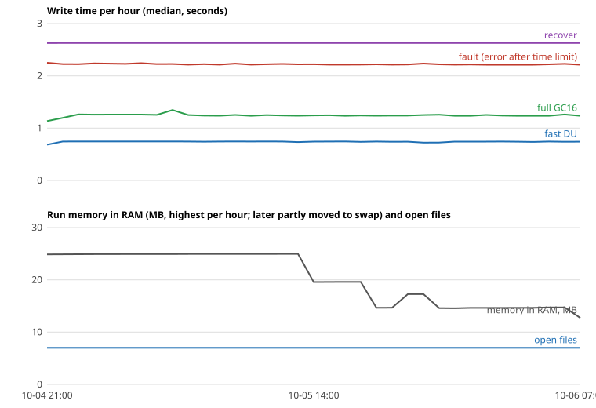

# IT8951 driver test round (M2)

Status: complete for review. The endurance run started 2026-10-04 21:25 (a first start at 21:13 was stopped after 7 writes for a reboot). By txoof's decision this report uses the first 34 hours (written 2026-10-06 07:48); the run keeps going until the screen is needed and later data is added only if it shows something new.

Tested on this Pi 4 (Raspberry Pi OS trixie, Python 3.13) with the Waveshare 9.7" e-paper HAT: IT8951 controller, firmware `WS_v.0.2T1`, LUT `8M14T`, 1200 × 825 pixels, VCOM -1.90 (from the ribbon cable). Test programs and raw results (CSV): `bench/it8951/`.

## Candidates

| # | Candidate | Result |
|---|---|---|
| 1 | GregDMeyer's Python/Cython driver (`9f136139`, 2023-11) | Tested. Builds and runs unchanged when the Python environment uses Raspberry Pi OS's `RPi.GPIO` compatibility package (`python3-rpi-lgpio`). |
| 2 | Waveshare's C driver called from Python | **Not tested** (txoof's decision). It switches the SPI chip-select pin (GPIO 8) by hand, but the kernel owns that pin on a normal setup, so it needs direct chip access or a `config.txt` change and a reboot. Its busy waits have no time limit. Details: `bench/it8951/results/waveshare_c.md`. |
| 3 | New small Python driver using `spidev` and `gpiod`, written for this test | Tested. |

## Timings

Median time per write, in seconds, measured until the controller reports the redraw is done. Each write starts by waking the controller.

| Write | Mode | Candidate 1 | Candidate 3 |
|---|---|---|---|
| Clear screen (full) | INIT | 1.61 | 1.78 |
| Full screen, 16 grays | GC16 | 0.71–0.94 | 0.81–1.01 |
| Small area 480 × 160 | GC16 | 0.52 | 0.62 |
| Small area 480 × 160 | DU | 0.32 | 0.39 |
| Small area 480 × 160 | A2 | 0.18 | 0.20 |
| Full screen, black and white | DU | 0.52 | 0.57 |
| Full screen, black and white | A2 | 0.37 | 0.40 |

Candidate 3 is about 0.1 s slower. Most of each write is spent waiting for the controller, so this makes no visible difference on an e-paper screen. Both are far faster than PaperPi needs: plugins update every few minutes, and music plugins accept a delay of a few seconds.

## Pin check

The test lists the GPIO pins in use (`gpioinfo`) before, during and after each run.

| | Candidate 1 | Candidate 3 |
|---|---|---|
| Pins taken | 17 (reset), 24 (busy) | 17 (reset), 24 (busy) |
| Released after close | yes | yes |

Both leave GPIO 18–21 and 2–3 alone, so neither can disturb the HiFiBerry DAC+ (decided with txoof: this check replaces a test with music playing).

## Recovery when the screen stops answering

Simulated in software only: the reset line is held low with `pinctrl` while a full write runs, at 0.05 s, 0.3 s and 0.6 s after the write starts (during the data transfer and during the redraw). Nothing is unplugged.

| | Candidate 1 | Candidate 3 |
|---|---|---|
| Write during fault | stops with `TimeoutError` after about 5 s | stops with `DisplayTimeout` after about 2 s |
| Next write, same process (close + open) | works | works |
| Next write, new process | works | works |
| Pins released afterwards | yes | yes |

Both pass. Notes:
- Candidate 1 has a fixed 5-second limit while waiting for the busy line, but its wait for the end of a redraw (`wait_display_ready`) has no limit. It passed because the busy line also went low during the fault.
- Candidate 1 has no close method. It releases its pins and SPI only when Python deletes the driver object (`SPI.__del__`), and calling that method directly closes the SPI file twice. Over months, a leftover reference (for example in an error report) would keep the pins taken.
- Candidate 3 has a time limit on every wait (2 s for the busy line, 15 s for a redraw, both settings) and a `close()` that always releases everything and can be called more than once.

## Viewing session

txoof judged the screen step by step. Image quality is decided by the controller, the panel and VCOM, not by the driver, so the full set of questions was done once (with candidate 1) and candidate 3 got a short check that it draws correctly. Answers: `bench/it8951/results/*-rubric.md`.

| What | Result |
|---|---|
| 16 gray levels | All 16 bars visible |
| Fine text | 9 px readable, sharpness 4 of 5 ("looks great") |
| Gradient | 16 clear bands, as expected without dithering (dithering of photos is done in epdlib, M3) |
| Fast updates, DU | Minimal ghosting (4 of 5) with candidate 1; no visible ghosting with candidate 3 |
| Fast updates, A2 | Clearly worse: vertical lines, leftover pixels, negative shadows |
| Full-screen DU over earlier content | Earlier digits show through |
| One full GC16 refresh afterwards | Still some ghosts (digits, lines, text) |
| INIT refresh | Removed all ghosts |
| Candidate 3 correctness | Gray bars and clock area correct, same as candidate 1 |

Conclusions:
- **Fast mode: DU**, not A2.
- **A cleaning refresh with INIT is needed now and then.** GC16 alone does not remove all leftovers. v1 did this too: it cleared with INIT before every 4th update (`max_refresh = 4`).

## Endurance run (candidate 3)

Decided with txoof: 72 hours, one write every 60 s (about 4,300 writes, under 0.5% of the 1 million refreshes Waveshare rates the panel for). Each write is a fast DU update of the clock area; every 5th write is a full GC16 page; every 10th write fails on purpose (reset held low during a full write), followed by close and open as PaperPi would do. After every write the run records the process's memory, open files, threads and child processes, and the Pi's free memory.

Purpose: find slow problems a short test cannot show: memory that is not given back, SPI or GPIO handles that are not closed (especially after errors), leftover processes, rare hangs, and write times that slowly grow.

A 2-minute trial before the real run (22 writes, 2 faults) showed: all faults stopped with an error and recovered in 2.6 s; open files stayed at 7, memory at about 24 MB.

### Results after 34 hours

Data: `bench/it8951/results/endurance-new-first-34h.csv` (2026-10-04 21:25 to 2026-10-06 07:47).

| Item | Result |
|---|---|
| Writes | 2,063 (1,651 fast, 206 full, 206 with a planned fault) |
| Unexpected failures | **0** |
| Planned faults | 206 of 206 stopped with `DisplayTimeout` (median 2.2 s) and recovered with close + open (2.6 s every time) |
| Hangs | none (the run's own 120 s watchdog never fired) |
| Write time, first vs last quarter (median) | fast 0.746 / 0.743 s; full 1.258 / 1.236 s; no growth |
| Open files | 7 the whole time, also after 206 error recoveries |
| Threads / child processes | 2 / 0 the whole time |
| Run memory | see below: no leak |

**Memory.** For the first 13 hours the run's memory in RAM grew slowly and the growth slowed down: 25,468 KB to 25,552 KB, about 8 KB per hour at first and about 1 KB per hour by hour 13. This is how Python's memory manager usually behaves (it keeps freed memory for reuse), not a leak. From hour 17 the number in the graph drops: other Claude Code sessions working on M3 and M4 on the same Pi used most of its 1.8 GB, and Linux moved unused parts of the run into swap (space on the SD card used as extra memory). At 34 hours the run used 11.9 MB in RAM plus 8.1 MB in swap, 20 MB in total: less than at the start. The Pi's free memory dropped to 186 MB at its lowest; that came from the parallel sessions, not the run, and write times did not change.

**What the run shows:** the new driver releases its SPI and GPIO handles every time, also after errors; it never waited past its time limit; and it does not slow down or leak over 2,000 writes and 206 recoveries. That is about 1.5 days of PaperPi use at one write per minute.

**What it cannot show:** that no problem happens over months. With 0 failures in 2,063 writes, a problem could still happen about once in every 700 writes or less often. This is covered by the design (time limits, watchdog, daily helper restart, Docker memory limit) and by the long run on this Pi from M4 on.
