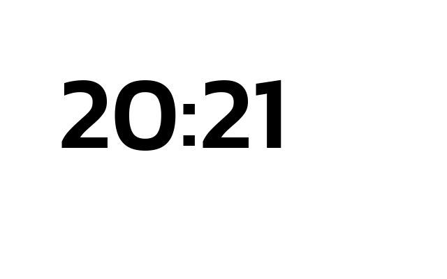
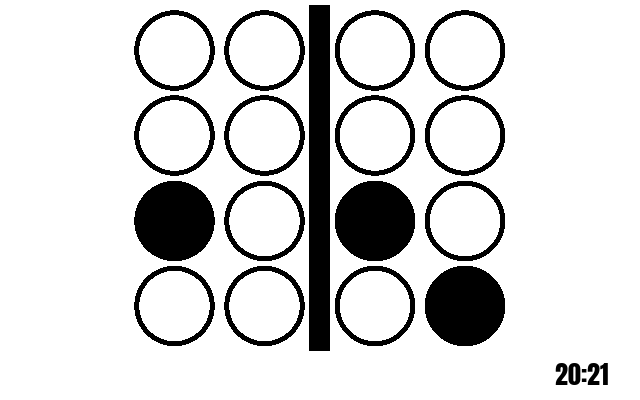
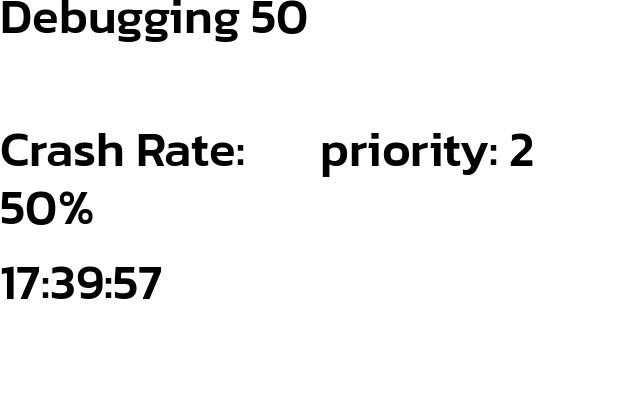
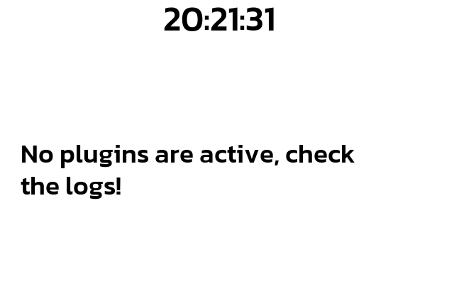
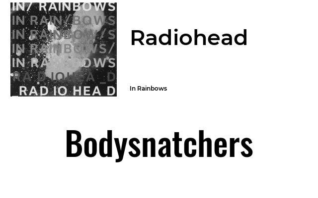
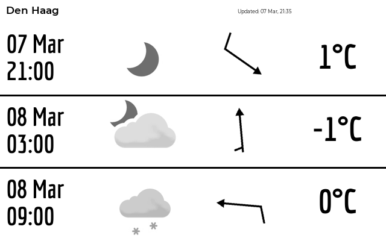
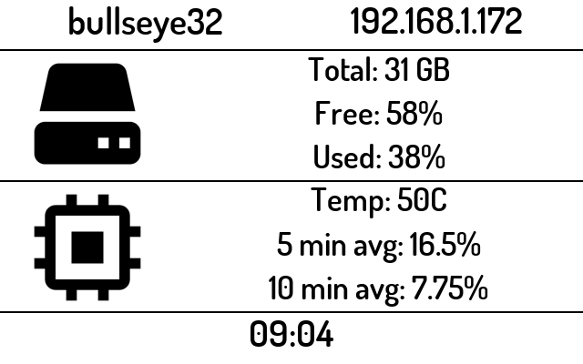

[start: introduction]: #
# Plugins
All plugins are configured through the `paperpi.ini` files. For a single-user configuration the file is stored in `~/.config/com.ysadamt.paperpi/` for system-wide daemon configuration the file is stored in `/etc/default/`.

[end: introduction]: #

[start: plugin_header]: #
## Available Plugins

[end: plugin_header]: #


[start: basic_clock]: #
### [basic_clock](../paperpi/plugins/basic_clock/README.md)


[end: basic_clock]: #


[start: dec_binary_clock]: #

### [dec_binary_clock](../paperpi/plugins/dec_binary_clock/README.md)




[end: dec_binary_clock]: #

[start: debugging]: #
### [debugging](../paperpi/plugins/debugging/README.md)


[end: debugging]: #

[start: default]: #
### [default](../paperpi/plugins/default/README.md)


[end: default]: #

[start: demo_plugin]: #
### [demo_plugin](../paperpi/plugins/demo_plugin/README.md)


[end: demo_plugin]: #

[start: librespot_client]: #
### [librespot_client](../paperpi/plugins/librespot_client/README.md) <font color="red">R</font><font color="green">G</font><font color="blue">B</font>


[end: librespot_client]: #

[start: lms_client]: #
### [lms_client](../paperpi/plugins/lms_client/README.md) <font color="red">R</font><font color="green">G</font><font color="blue">B</font>


[end: lms_client]: #

[start: met_no]: #
### [met_no](../paperpi/plugins/met_no/README.md) <font color="red">R</font><font color="green">G</font><font color="blue">B</font>


[end: met_no]: #

[start: moon_phase]: #
### [moon_phase](../paperpi/plugins/moon_phase/README.md)


[end: moon_phase]: #

[start: newyorker]: #
### [newyorker](../paperpi/plugins/newyorker/README.md)


[end: newyorker]: #

[start: reddit_quote]: #
### [reddit_quote](../paperpi/plugins/reddit_quote/README.md) <font color="red">R</font><font color="green">G</font><font color="blue">B</font>


[end: reddit_quote]: #

[start: slideshow]: #
### [slideshow](../paperpi/plugins/slideshow/README.md) <font color="red">R</font><font color="green">G</font><font color="blue">B</font>


[end: slideshow]: #

[start: splash_screen]: #
### [splash_screen](../paperpi/plugins/splash_screen/README.md)


[end: splash_screen]: #

[start: system_info]: #
### [system_info](../paperpi/plugins/system_info/README.md) <font color="red">R</font><font color="green">G</font><font color="blue">B</font>


[end: system_info]: #


[start: word_clock]: #
### [word_clock](../paperpi/plugins/word_clock/README.md) <font color="red">R</font><font color="green">G</font><font color="blue">B</font>


[end: word_clock]: #
[start: xkcd_comic]: #
### [xkcd_comic](../paperpi/plugins/xkcd_comic/README.md)


[end: xkcd_comic]: #


[start: crypto]: #

### crypto
**NOTE: This plugin is not supported as of V0.5.5**

[end: crypto]: #


[start: configuration]: #
## Configuration

Each plugin is configured through a [Plugin: Name] section in the configuration files. 

Plugins can be added multiple times (e.g. to show weather in multiple locations or track multiple LMS Players), but each plugin configuration section must have a unique name.

To use a plugin, add a configuration section for each plugin instance to the appropriate configuration file:
 * user: `~/.config/com.ysadamt.paperpi/paperpi.ini`
  * daemon: `/etc/default/paperpi.ini`
   
   Plugin configuration sections follow this pattern. Some plugins require extra configuration such as API keys or lat/lon data.

   *NB: whitespace and comments are ignored*
   ```
   [Plugin: Human Friendly Name For Plugin]
   # layout to use
   layout = layout
   # this should match the directory and plugin name exactly
   plugin = plugin_name
   # maximum refresh rate in seconds
   refresh_rate = int
   # maximum priority for this plugin -- lower numbers are higher priority, -1 will always display
   max_priority = int
   # minimum amount of time plugin should stay on the screen when displayed
   min_display_time = int
   ```

   Plugins provide a sample configuration in their documentation. Use the following commands to find a list of plugins and view their sample configurations:

   **List Available Plugins**

   `paperpi --list_plugins`

   **Show Plugin Documentation**

   `paperpi --plugin_info plugin_name`

   **Add Default Configuration**

   Paperpi can add the default plugin configuration to either the user or daemon config files.

   `paperpi --add_config plugin_name user|daemon`

   *NB:* It is important to check the configuration file; some plugins require additional configuration

### Configuration Elements

**Section Header**: `[Plugin: Human-Friendly Name for Plugin]`
* all plugin sections must **start** with `[Plugin: XXXX]` where XXX is a user-chosen descriptive string
* all section headers must be unique
* enabled: `[Plugin: name]`
* disabled: `[xPlugin: name]`

**Plugin Name**: `plugin = plugin_name`
* module name of plugin
* use `--list_plugins` to see available plugin names

**Layout Definition**: `layout = layout`
* screen layout that defines how to organize plugin graphical and text elements
* use `--plugin_info plugin_name` to see available layouts
* see the documentation for each plugin for a sample of all available layouts
* some layouts may be more appropriate for smaller screens

**Refresh Rate**: `refresh_rate = integer in seconds`
* this controls how often the plugin is checked for new data
* some services such as spotify or MET.NO will ban users that request updates too frequently. Use caution when setting this.
* each plugin has a recommended `refresh_rate` use `--plugin_info plugin_name` to view a sample configuration

**Maximum Priority**: `max_priority = integer`
* **LOWER** numbers are a higher priority (-1 is very high and will likely display immediately, 64000 will never be shown)
* a music plugin should likely be set to `0` to ensure that when a track change happens the display is updated
* a clock plugin that displays when music players are idle should be set to 2
* plugins with the lowest integer value will be displayed in the display loop
* some plugins change their priority when events happen such as when an audio track changes, music is paused, or a device becomes idle
* this value determines the maximum priority the plugin will use when it determines an important event has occurred.
* recommended values can be found by using `--plugin_info plugin_name`

**Minimum Display Time** `min_display_time = integer in seconds`
* number of seconds plugin should stay on the screen before another plugin is cycled
* recommended values can be found using `--plugin_info plugin_name`

### Additional Configuration Elements

Some plugins require additional configuration such as API keys, location information or other configuration details. Use `--plugin_info plugin_name` to find a sample configuration. Check the plugin README for additional information.

[end: configuration]: #

[start: developing]: #
## Developing Plugins

PaperPi is designed to support additional plugins written in Python 3. Any modules available through PyPi or through a git repository may be used.

For more information see [Developing Plugins](./developing_plugins.md)
[end: developing]: #
