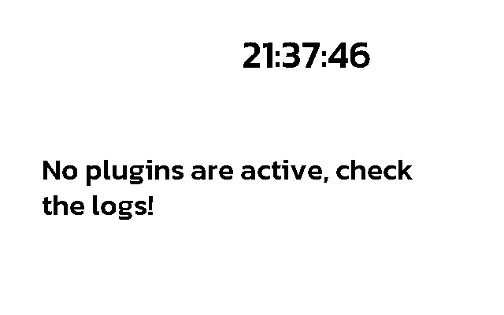
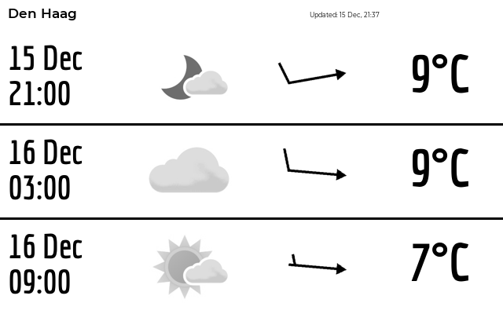

# Plugins

All plugins are configured through the `paperpi.ini` files. For a single-user configuration the file is stored in `~/.config/com.txoof.paperpi/` for system-wide daemon configuration the file is stored in `/etc/defaults/`.

## Plugins Currently Available

### [reddit_quote](../paperpi/plugins/reddit_quote/README.md)


### [librespot_client](../paperpi/plugins/librespot_client/README.md)


### [moon_phase](../paperpi/plugins/moon_phase/README.md)


### [lms_client](../paperpi/plugins/lms_client/README.md)


### [splash_screen](../paperpi/plugins/splash_screen/README.md)


### [basic_clock](../paperpi/plugins/basic_clock/README.md)


### [xkcd_comic](../paperpi/plugins/xkcd_comic/README.md)


### [word_clock](../paperpi/plugins/word_clock/README.md)


### [demo_plugin](../paperpi/plugins/demo_plugin/README.md)


### [newyorker](../paperpi/plugins/newyorker/README.md)


### [default](../paperpi/plugins/default/README.md)



### [met_no](../paperpi/plugins/met_no/README.md)



### [crypto](../paperpi/plugins/crypto/README.md)


### [dec_binary_clock](../paperpi/plugins/dec_binary_clock/README.md)


## Configuration

Each plugin is configured through a [Plugin: Name] section in the configuration files.

Plugins can be added multiple times (e.g. to show weather in multiple locations or track multiple LMS Players), but each plugin configuration section must have a unique name.

To use a plugin, add a configuration section for each plugin instance to the appropriate configuration file:

* user: `~/.config/com.txoof.paperpi/paperpi.ini`
* daemon: `/etc/defaults/paperpi.ini`

Plugin configuration sections follow this pattern. Some plugins require extra configuration such as API keys or lat/lon data.

*NB: whitespace and comments are ignored*

```
[Plugin: Human Friendly Name For Plugin]
# layout to use
layout = layout
# this should match the directory and plugin name exactly
plugin = plugin_name
# maximum refresh rate in seconds
refresh_rate = int
# maximum priority for this plugin -- lower numbers are higher priority, -1 will always display
max_priority = int
# minimum amount of time plugin should stay on the screen when displayed
min_display_time = int
```

Plugins provide a sample configuration in their documentation. Use the following commands to find a list of plugins and view their sample configurations:

**List Available Plugins**

`paperpi --list_plugins`

**Show Plugin Documentation**

`paperpi --plugin_info plugin_name`

**Add Default Configuration**

Paperpi can add the default plugin configuration to either the user or daemon config files.

`paperpi --add_config plugin_name user|daemon`

*NB:* It is important to check the configuration file; some plugins require additional configuration

### Configuration Elements

**Section Header**: `[Plugin: Human-Friendly Name for Plugin]`

* all plugin sections must **start** with `[Plugin: XXXX]` where XXX is a user-chosen descriptive string
* all section headers must be unique
* enabled: `[Plugin: name]`
* disabled: `[xPlugin: name]`

**Plugin Name**: `plugin = plugin_name`

* module name of plugin
* use `--list_plugins` to see available plugin names

**Layout Definition**: `layout = layout`

* screen layout that defines how to organize plugin graphical and text elements
* use `--plugin_info plugin_name` to see available layouts
* see the documentation for each plugin for a sample of all available layouts
* some layouts may be more appropriate for smaller screens

**Refresh Rate**: `refresh_rate = integer in seconds`

* this controls how often the plugin is checked for new data
* some services such as spotify or MET.NO will ban users that request updates too frequently. Use caution when setting this.
* each plugin has a recommended `refresh_rate` use `--plugin_info plugin_name` to view a sample configuration

**Maximum Priority**: `max_priority = integer`

* **LOWER** numbers are a higher priority (-1 is very high and will likely display immediately, 64000 will never be shown)
* a music plugin should likely be set to `0` to ensure that when a track change happens the display is updated
* a clock plugin that displays when music players are idle should be set to 2
* plugins with the lowest integer value will be displayed in the display loop
* some plugins change their priority when events happen such as when an audio track changes, music is paused, or a device becomes idle
* this value determines the maximum priority the plugin will use when it determines an important event has occurred.
* recommended values can be found by using `--plugin_info plugin_name`

**Minimum Display Time** `min_display_time = integer in seconds`

* number of seconds plugin should stay on the screen before another plugin is cycled
* recommended values can be found using `--plugin_info plugin_name`

### Additional Configuration Elements

Some plugins require additional configuration such as API keys, location information or other configuration details. Use `--plugin_info plugin_name` to find a sample configuration. Check the plugin README for additional information.


## Writing Plugins

PaperPi is designed to support additional plugins written in Python 3. Any modules available through PyPi may be used.

When PaperPi starts, all plugins that are configured and active are added as `self.update_function` to a generic `Plugin` class. This happens automatically and is managed for you. The `Plugin` class offers several built-in functions and properties that plugins can take advantage of. See the "BUILTIN FUNCTIONS" section below.

See the included [`demo_plugin`](../paperpi/plugins/demo_plugin) for a simple, well documented plugin that can be used as a template for building a plugin.

### PLUGIN REQUIREMENTS

Plugin must contain, at minimum, a `[plugin_name].py` file that contains an `update_function()`. Addtional files are also required for a complete plugin package. See the [Packaging Plugins](#packaging-plugins) section below.

#### `update_function()`

* Must return a 3-tuple of `(is_updated(bool), data(dict), priority(int))
* Must accept args/kwargs
* Must have a docstring that explains it's basic function and any information an end user may need to configure/setup the plugin. This docstring must end with exactly `%U` on the very last line. The docstring will be displayed when using the `--plugin_info` option.

#### User-facing functions

Plugins may contain user-facing functions that can be run from the command line using the `--run_plugin_func plugin_name.function`. For an example, see the `met_no.get_coord` user-facing function.

User-facing functions should have a docstring that ends with `%U` on the very last line. The docstring should explain the function and it's usage. The docstring will be displayed when using the `--plugin_info plugin_name.function` option.

### BUILTIN FUNCTIONS AVAILABLE TO PLUGINS

All plugins have the following functions and properties available. Call the builtin functions by using `self.[method/property]`.

**Plugin Class Methods and Properties**

* resolution(`tuple` of `int`): resolution of the epd or similar screen: (Length, Width)
* name(`str`): human readable name of the function for logging and reference
* layout(`dict`): epdlib.Layout.layout dictionary that describes screen layout
* max_priority(`int`): maximum priority for this module values approaching 0 have highest priority, values < 0 are inactive
* refresh_rate(`int`): minimum time in seconds between requests for pulling an update
* min_display_time(`int`): minimum time in seconds plugin should be allowed to display in the loop
* config(`dict`): any kwargs in the plugin configuration from `paperpi.ini`
* cache(`CacheFiles` obj): object that can be used for downloading remote files and caching
  * `cache_file(self, url, file_id, force=False)` download a remote file and return the local path to the file if a local file with the same name is found, download is skipped and path returned
    * Args:
      * url(`str`): url to remote file
      * file_id(`str`): name to use for local file
      * force(`bool`): force a download ignoring local files with the same name
  * `cleanup(self)` recursively remove all cached files and cache path (this is typically only used when shutting down the application)
    * Properties:
      * cache_path(`pathlib.PosixPath`): top-level path to cache files

Plugins are written in python 3 and should follow the following guidelines to function properly:

### PACKAGING PLUGINS

Installable Plugins consist of a .tar.gz file that contains the basic structure below. Substitute your plugin name for `[plugin_name]` as appropriate All files/directories marked with a `^` are optional and not required.
```
[plugin_name]/
├── __init__.py
├── constants.py
├── debian_packages-[plugin_name].txt^
├── layout.py
├── [plugin_name].py
├── [plugin_name].layout-sample.png
├── requirements-[plugin_name].txt^
├── README.md
├── README_additional.md^
├── sample.py
├── additional_content^/
│   └── additional_content.foo^
└── additional_files^/
    └── additional_files.bar^
```

#### **--REQUIRED FILES--**

#### `__init__.py`

Purpose: Allows PaperPi to properly import your `update_function()`

Required contents:

```from .[plugin_name] import update_function```

#### `constants.py`

Purpose: Any constants related to your plugin as well as the name, version number data set provided to layouts and a sample configuration.

Required contents:

* `version` version number of plugin
* `data` contains a default data set this information is displayed when `--plugin_info` is called. These are all of the data keys your plugin provides that _can_ be used by layouts.
* `sample_config` docstring that contains a sample, working configuration for your plugin. The `sample_config` string is added to the user or system config when `--add_config` is called.

```
version = '0.0.0'
name = '[plugin_name]'
data = { 'key0': default_value,
         'key1': default_value,
         'keyn': default_value
       }
sample_config = '''
[Plugin: [Human Readable Name for plugin_name]]
layout = layout
plugin = plugin_name
refresh_rate = 60
min_display_time = 120
max_priority = 2
plugin_specific_kwarg0 = foo
plugin_specific_kwarg1 = bar
# add any notes or comments like this:
# make sure you generate an API key by visiting spam.ham
plugin_name_api_key = YOUR_API_KEY_HERE
'''
```

#### `layout.py`

Purpose: contains all possible layout supported by your plugin. See the [EPDLib Layout](https://github.com/txoof/epdlib#Layout) module for more information on crafting layouts.

Required Contents:

* `layout` default layout for your plugin. It is acceptable to use a variable assignment such as `layout = complex_name_for_layout`.
```
layout = { layout definition }
```

#### `[plugin_name].py`

Purpose: entry point for your module. This file must contain the `update_function()` for your plugin. This file must have exactly same name as the plugin directory.

Required Contents:
```
def update_function():
  # do stuff
  return (is_updated, data, priority)
```

#### `[plugin_name].png`

Purpsose: Image used in README for your plugin. This is automatically generated by running `$ pipenv run python ./utilities/create_docs.py`. If you have multiple layouts, a sample png will be generated for each layout.


### README.md

Purpose: Automatically generated by the `create_docs.py` script. This includes the docstring from the `update_function()`, sample images for all of the possible layouts as well as any additional information that is appended from README_additional.py

#### `sample.py`

Purpose: Provides a sample configuration for the `create_docs.py` script. This provides a configuration that will allow plugin to be initiated, and sample images created for all possible plugins.

**NB!** make sure you do not leave any sensitive API keys in this after you have generated your sample images with `create_docs.py`

Required Contents:
```
config = {
    # this must be a valid layout
    'layout': 'layout',
    'plugin_specific_kwarg_config_option': 'Spam, spam, spam and eggs',
    'additional_config_option': 10 
}
```

#### **--OPTIONAL FILES--**

#### `debian_packages-[plugin_name].txt` -- optional

Purpose: Provides any additional Debian packages that must be installed for your plugin to function.

Required Contents:
```
# this is a BASH array, not python! Follow the format shown here exactly!
# Use only spaces, no commas, and surround all names with double quotes
DEBPKG=( "deb-package-name0" "deb-package-name1" )
```

#### `README_additional.md`

Purpose: Provides additional information about the plugin that is not covered in the docstring provided by `update_function()`. This is automatically appended to the README.md by the `create_docs.py` script. The [LMS-Client](../paperpi/plugins/lms_client/) has an example a `README_additional.md` file. 

#### `requirements-[plugin_name].txt`

Purpose: Provides any additional python modules that must be installed for your plugin to function. This can be generated by running the `./utilities/find_imports.sh` script.

Required Contents:
```
foo-module1
bar-module2
py-module3
```

#### Additional Content

Any additional support files or sub directories can be be placed in the root of your plugin directory.

## Adding Plugins to PaperPi

UNDER REVIEW