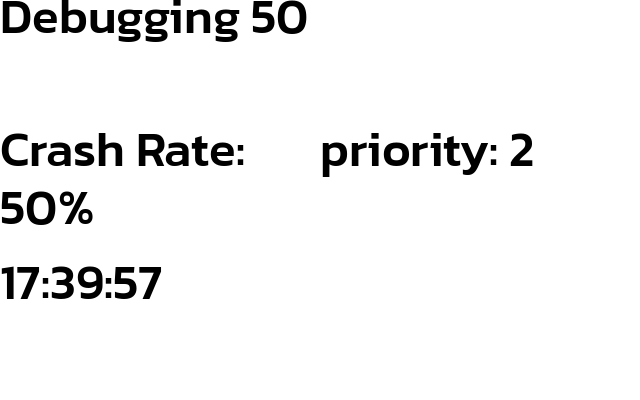

# debugging


```ini
 
PLUGIN: debugging v:0.1.0

 
FUNCTION: update_function
update function for debugging plugin provides title, time, crash rate
    
    This plugin shows minimal data and is designed to throw exceptions to test other functionality. 
    The plugin will deliberately and randomly throw exceptions at the rate specified in the configuration. 
    When an exception is not thrown, the plugin will randomly change its priority to the max set in the 
    configuration. Set the rate at which the plugin should jump to the higher priority status in the configuration.
    
    
    Args:
        self(`namespace`)
        title(`str`): title of plugin to display
        crash_rate(`float`): value between 0 and 1 indicating probability of throwing 
            exception on execution
    
___________________________________________________________________________
 
 

SAMPLE CONFIGURATION FOR paperpi.plugins.debugging.debugging

[Plugin: Debugging 50]
layout = debugging_basic
plugin = debugging
min_display_time = 50
max_priority = 1
refresh_rate = 5
title = Debugging 50
crash_rate = .5
max_priority_rate = .1
min_priority = 2

 
LAYOUTS AVAILABLE:
  debugging_basic
  layout
 

DATA KEYS AVAILABLE FOR USE IN LAYOUTS PROVIDED BY paperpi.plugins.debugging.debugging:
   title
   crash_rate
```

## Provided Layouts

layout: **debugging_basic**

 


layout: **layout**

 


