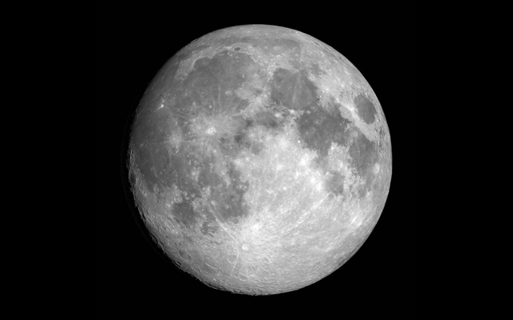

# moon_phase


```ini
 
PLUGIN: moon_phase v:0.1.0

 
FUNCTION: get_coord
USER FACING HELPER FUNCTION:
    lookup and my_print the latitude, longitude of a place given as a string:
    
    usage: --run_plugin_func moon_phase.get_coord "Cotu, Provence, Country"
    
    --run_plugin_func moon_phase.get_coord "Morrison, Colorado, USA"
    >>> Morrison, Jefferson County, Colorado, 80465, United States
    Morrison, Colorado, USA:
    lat: 39.642
    lon: -105.193
    ('39.6422', '-105.19332324506902')
    
    Args:
        place(`str`): "City, Provence, Country
    
    Returns:
        `tuple`: lat, lon
        
    Example:
        get_coord("Denver, Colorado, USA")
        get_coord("Bamako, Mali")
        
___________________________________________________________________________
 
FUNCTION: list_country_locales
USER FACING HELPER FUNCTION:
    Print the known timezones for a country specified 
    with two letter country code:
    
    usage: 
    --run_plugin_func moon_phase.list_country_locales <ISO 3166 Country Code>
    
    --run_plugin_func moon_phase.list_country_locales NZ
    >>> ['Pacific/Auckland', 'Pacific/Chatham']
    
    Args:
        country(`str`): two letter ISO 3166 country code
    
    
___________________________________________________________________________
 
FUNCTION: update_function
update function for moon_phase plugin provides an image of the moon and moon data for a location
    
    This plugin provides the following information:
    
     * Accurate image of the moon at moon rise
     * Moon Rise time at location
     
    
    Configuration Requirements:
        self.config(dict): {
            'location_name': 'Europe/Amsterdam', 
            'email': Your_Email@some.domain,
            'lat': xx.yy,     # this is optional, but will provide more accuracy
            'lon': -ss.qq,    # this is optional, but will provide more accuracy
        }
        
    Args: 
        self.cache(`CacheFiles` object)
        
    Args:
        self(namespace): namespace from plugin object
    
    Returns:
        tuple: (is_updated(bool), data(dict), priority(int))
        
    
    Images are sourced from of NASA's Scientific Visualization sutudio: https://svs.gsfc.nasa.gov/4955#32006
    and represent the first full lunar month of 2022.
    
    Moonrise data is sourced from the Meteorologisk Institutt of Norway: 
    https://api.met.no/weatherapi/sunrise/2.0/documentation#!/data/get
            
    
___________________________________________________________________________
 
 

SAMPLE CONFIGURATION FOR paperpi.plugins.moon_phase.moon_phase

[Plugin: Moon Phase]
# default layout
layout = layout
plugin = moon_phase
min_display_time = 30
max_priority = 2
refresh_rate = 1200
# your email address for MET.no API access -- failure to specify may lead to a perma-ban
email = you@host.diamond
# Timezone locale name in Region/City format (see --run_plugin_func moon_phase.list_country_locales)
# Use a known city in your timezone; this is critical for calculating the moonrise time
location_name = Europe/Amsterdam
# lat/lon of your physical location (optional) (see --run_plugin_func moon_phase.get_coord)
lat = 52.3
lon = 4.9

 
LAYOUTS AVAILABLE:
  layout
  moon_data
  moon_only
 

DATA KEYS AVAILABLE FOR USE IN LAYOUTS PROVIDED BY paperpi.plugins.moon_phase.moon_phase:
   moonrise
   moonset
   age
   image_file
   phase_desc
```

## Provided Layouts

layout: **layout**

 


layout: **moon_data**

 


layout: **moon_only**

 


## Additional Plugin Information

### Configuration Notes

*Sample Configuration*
```
[Plugin: Moon Phases]
layout = layout
plugin = moon_phase
refresh_rate = 600
min_display_time = 40
max_priority = 2
location_name = America/Denver
# Failure to provide a unique identifier can result in a perma-ban from the Met.NO API
email = you@host.diamond
# Lat/Lon are optional, but will increase accuracy for moonrise and moonset times
lat = 39.739
lon = -104.985
```
**location_name**

To find the `location_name`, use `paperpi --run_plugin_func moon_phase.list_country_locales XX` where XX is the two letter [ISO 3116 country codes](https://en.wikipedia.org/wiki/List_of_ISO_3166_country_codes) to find the region/locale names.

**email**
The ***FREE*** APIs at MET.NO are available to everyone with no registration, no key and very few limitations. MET.NO offers this great API with the minor expectation that you identify yourself. Please fill in a real email address or risk being banned from the service.

**lat/lon**

To find the lat/lon of a particular location use `paperpi --run_plugin_func moon_phase.get_coord "City, Provence, Country"` The `lat` and `lon` values are entirely optional. If they are omitted the plugin will use the lat/lon of the `location_name`.

### Moon Images
The moon images are the first full lunar cycle of 2022: 2022.01.02 - 2022.02.01 and are sourced from [NASA](https://svs.gsfc.nasa.gov/4955). The images accurately show the relative size and angle of the moon relative to the earth for that month. 

### Moon Phase Data
The moon phase data is sourced from the [Norwegian Meteorolgisk Institutt](https://api.met.no/weatherapi/sunrise/2.0/documentation#!/data/get_format) API. MET provides tons of amazing free APIs with oceanic, meterological and air quality forecasts. Some of the information is limited to Norwegian locales, but other information such as the weather forecasts are available world-wide.