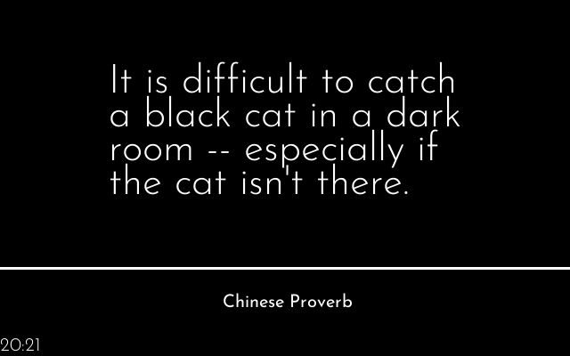
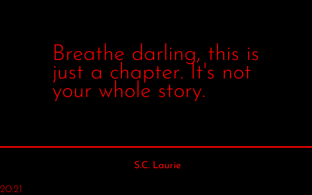

# reddit_quote <font color="red">R</font><font color="green">G</font><font color="blue">B</font>


```ini
 
PLUGIN: reddit_quote v:0.1.2

 
FUNCTION: update_function
update function for reddit_quote plugin
    
    Scrapes quotes from reddit.com/r/quotes and displays them one at a time
    
   Requirements:
        self.config(`dict`): {
        'max_length': 144,   # name of player to track
        'idle_timeout': 10,               # timeout for disabling plugin
    }
    self.cache(`CacheFiles` object)

    Args:
        self(namespace): namespace from plugin object
        
    Returns:
        tuple: (is_updated(bool), data(dict), priority(int))   
        
    This plugin is inspired by and based on the veeb.ch [stonks project](https://github.com/veebch/stonks)
    
    
___________________________________________________________________________
 
 

SAMPLE CONFIGURATION FOR paperpi.plugins.reddit_quote.reddit_quote

[Plugin: Reddit Quotes]
layout = layout
plugin = reddit_quote
refresh_rate = 100
min_display_time = 50
max_priority = 2
# maximum length of quote (in characters) including spaces, a la Twitter
max_length = 144
# Text/background color [RED, ORANGE, YELLOW, GREEN, BLUE, BLACK WHITE] or random
# bkground color is not supported in this plugin 
# text_color = RED
# bkground_color = random

 
LAYOUTS AVAILABLE:
  layout
  quote
  quote_inverse
  quote_small_screen
 

DATA KEYS AVAILABLE FOR USE IN LAYOUTS PROVIDED BY paperpi.plugins.reddit_quote.reddit_quote:
```

## Provided Layouts

layout: **layout**

 


layout: **<font color="red">R</font><font color="green">G</font><font color="blue">B</font> layout**

 


layout: **quote**

 


layout: **<font color="red">R</font><font color="green">G</font><font color="blue">B</font> quote**

 


layout: **quote_inverse**

 


layout: **<font color="red">R</font><font color="green">G</font><font color="blue">B</font> quote_inverse**

 


layout: **quote_small_screen**

 


layout: **<font color="red">R</font><font color="green">G</font><font color="blue">B</font> quote_small_screen**

 


## Additional Plugin Information
This plugin is based on the [veebch/stonks](https://github.com/veebch/stonks) and [veebch/edify](https://github.com/veebch/edify) application. The code is mostly rewritten, but the basic layout and much of the logic is borrowed.