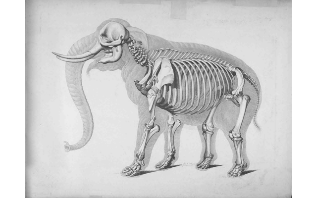

# slideshow
 

```
 
PLUGIN: slideshow v:0.1.0

 
FUNCTION: update_function
update function for slideshow plugin
    
    This plugin choose an image from a specified directory and displays it
    along with some optional information such as the time and a filename. 
    
    Images are displayed in either `random` or `sequential` order. 
    
    Each time the plugin runs the `image_path` is re-indexed. If images are added
    or removed from the `image_path`, they will be used in the rotation. 
    
    
    Requirements:
        self.config(dict): {
            'image_path': '/absolute/path/to/images',
            'order': 'random',
        }
        
    Args: 
        self(namespace): namespace from plugin object
    
    Returns:
        tuple: (is_updated(bool), data(dict), priority(int))

    
___________________________________________________________________________
 
 

SAMPLE CONFIGURATION FOR paperpi.plugins.slideshow.slideshow

[Plugin: Slideshow]
# default layout
layout = layout
plugin = slideshow
# time between choosing new image (seconds)
refresh_rate = 90
# recommended display time (seconds)
min_display_time = 30
# maximum priority in display loop
max_priority = 2
# path to image directory
image_path = /pi/documents/images
# order to pull images in: random, sequential
order = random
# frame style to use (see README)
frame = black & silver: matted

 
LAYOUTS AVAILABLE:
  image_only_centered_blackbkground
  image_only_centered_whitebkground
  image_time_centered_blackbkground
  image_time_centered_whitebkground
  layout
 

DATA KEYS AVAILABLE FOR USE IN LAYOUTS PROVIDED BY paperpi.plugins.slideshow.slideshow:
   time
   filename
   image
```

## Provided Layouts: 

layout: **image_only_centered_blackbkground**

 


layout: **image_only_centered_whitebkground**

 


layout: **image_time_centered_blackbkground**

 


layout: **image_time_centered_whitebkground**

 


## Additional Plugin Information

### Configuration Options:

```ini
image_path = /full/path/to/source/images
order = sequential | random
frame = frame style | random
```

* `image_path`: is the full path to the images that should be used for each update
* `order`: choose either `sequential` or `random`
* `frame`: choose one of the frame styles below or `None`

|  |  |  |
|:---:|:---:|:---:|
| <br />black & silver: matted | <br />dim-gray & silver: matted | <br />thick black: matted |
| <br />thin black: matted | <br />thick black | <br />thin black |
| <br />none | random (choose random frame style) |  |

Valid Frame Values:

* black & silver: matted
* dim-gray & silver: matted
* thick black: matted
* thin black: matted
* thick black
* thin black
* none


### Attributions

If the slideshow plugin fails to access the configured image path, it will fall back to several supplied images. The included images were sourced from the Flicker [Biodiversity Heritage Library](https://www.flickr.com/photos/61021753@N02/).


