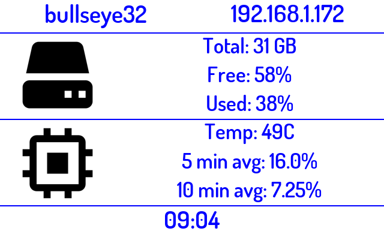

# system_info <font color="red">R</font><font color="green">G</font><font color="blue">B</font>


```ini
 
PLUGIN: system_info v:0.1.0

 
FUNCTION: update_function
update function for system_info to display system information including:
        Network Info:
            * IP address
            * Hostname
            
        Storage Info:
            * Total storage
            * Percent used
            * Percent free
            
        CPU Usage Info:
            * Temperature
            * 5 minute load average
            * 10 minute load average
            * 15 minute load average
    
    Supports RGB text
    
    Configuration Requirements:
        self.config(dict): {
            'storage_unit': 'GB' # optional units to use for storage (KB, MB, GB, TB, EB)
            'text_color': 'Black' # optional 
            'bkground_color': 'White' # optional
        }
        
    Args: 
        self(namespace): namespace from plugin object
    
    Returns:
        tuple: (is_updated(bool), data(dict), priority(int))

    
___________________________________________________________________________
 
 

SAMPLE CONFIGURATION FOR paperpi.plugins.system_info.system_info

[Plugin: System Info]
# show basic facts about the system including IP, Hostname, CPU usage, temperature and storage
# default layout
layout = layout
# the literal name of your module
plugin = system_info
# recommended display time
min_display_time = 45
# maximum priority in display loop
max_priority = 2
# storage units in decimal: [KB] KiloByte 10^3; [MB] MegaByte 10^6; [GB] GigaByte 10^12; [TB] TeraByte 10^12
storage_unit = GB
# colors for RGB screens
text_color = BLUE
bkground_color = WHITE

 
LAYOUTS AVAILABLE:
  basic_layout
  layout
 

DATA KEYS AVAILABLE FOR USE IN LAYOUTS PROVIDED BY paperpi.plugins.system_info.system_info:
   hostname
   time
   disk_total
   diskuse
   diskuse_pct
   diskfree
   diskfree_pct
   cpuload_5
   cpuload_10
   cpuload_15
   ipaddress
   cputemp
```

## Provided Layouts

layout: **basic_layout**

 


layout: **<font color="red">R</font><font color="green">G</font><font color="blue">B</font> basic_layout**

 


layout: **layout**

 


layout: **<font color="red">R</font><font color="green">G</font><font color="blue">B</font> layout**

 


## Additional Plugin Information

The following data are returned by the plugin for use in layouts:
* hostname: hostname if available
* ipaddress: current ipaddress, falls back to 127.0.0.1
* time: local time
* disk_total: total mounted storage
* diskuse: total disk use provided in specified units
* diskuse_pct: percentage of total storage used
* diskfree: total disk free provided in specified units
* diskfree_pct: percentage of total storage free
* cpuload_5;10;15: cpu load average over 5, 10, 15 minutes
* cputemp: cpu temperature
