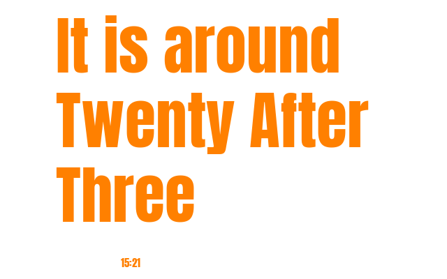

# word_clock <font color="red">R</font><font color="green">G</font><font color="blue">B</font>


```ini
 
PLUGIN: word_clock v:0.1.2

 
FUNCTION: update_function
update function for word_clock provides time as text
    
    This plugin provides the time as a string such as:
        * The time is around ten twenty
        * It is about twenty after eight
    
    Args:
        self(`namespace`)
        time(`str`): time as a string in format HH:MM (primarily used for testing)
        
    Returns:
        tuple: (is_updated(bool), data(dict), priority(int))    
    
___________________________________________________________________________
 
 

SAMPLE CONFIGURATION FOR paperpi.plugins.word_clock.word_clock

[Plugin: Word Clock]
layout = layout
plugin = word_clock
refresh_rate = 125
min_display_time = 255
max_priority = 2
# Text color [RED, ORANGE, YELLOW, GREEN, BLUE, BLACK WHITE] or random
# text_color = random
# bkground_color = random

 
LAYOUTS AVAILABLE:
  layout
  word_clock
  word_clock_lg
 

DATA KEYS AVAILABLE FOR USE IN LAYOUTS PROVIDED BY paperpi.plugins.word_clock.word_clock:
   word_time
   time
```

## Provided Layouts

layout: **<font color="red">R</font><font color="green">G</font><font color="blue">B</font> layout**

 


layout: **layout**

 


layout: **<font color="red">R</font><font color="green">G</font><font color="blue">B</font> word_clock**

 


layout: **word_clock**

 


layout: **<font color="red">R</font><font color="green">G</font><font color="blue">B</font> word_clock_lg**

 


layout: **word_clock_lg**

 


