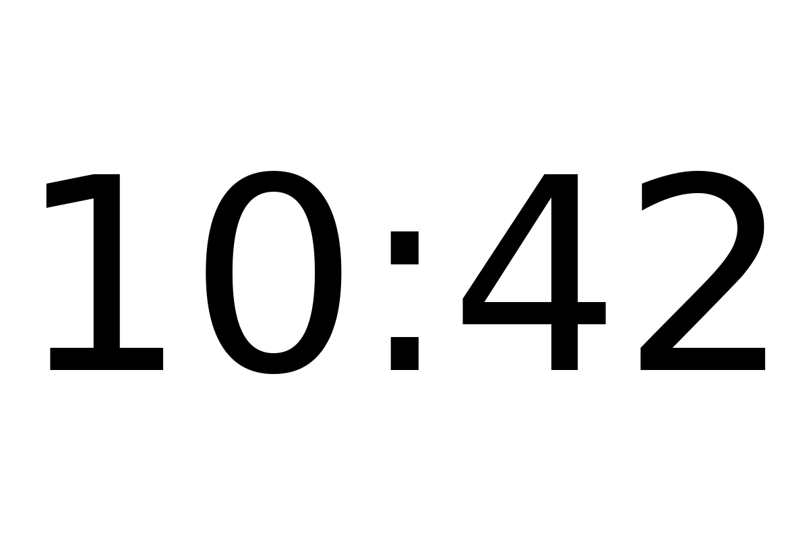
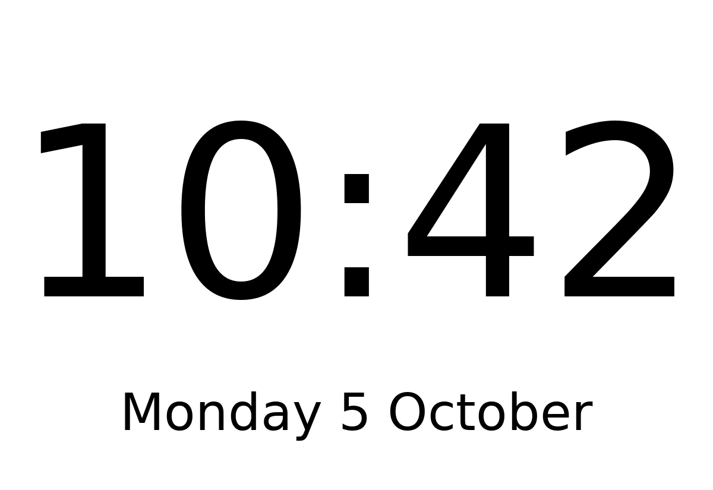

# basic_clock

Shows the time in large digits, and optionally the date below it. It needs no network.

## Layouts

| Layout | Shows |
|---|---|
| `time` (default) | the time only, as large as fits |
| `time_date` | the time, with the date below it ("Monday 5 October") |

## Settings

| Setting | Default | Meaning |
|---|---|---|
| `hours` | `24` | `24` shows 15:45, `12` shows 3:45 PM |

It suggests a refresh every 60 seconds, starting just after the minute changes (this takes effect once the scheduler is built, M4 part 2).

In the config file (the rest of the file is shown in the main [README](../../../../README.md)):

```toml
[[plugin]]
name = "Clock"
type = "basic_clock"
layout = "time_date"
hours = 12
```

Try it without a screen: `uv run paperpi render basic_clock --layout time_date --set hours=12`.

## Sample images

Sample time: 10:42 on Monday 5 October 2026. All sample images are in [`tests/images/`](../../../../tests/images/), named `basic_clock-<layout>[-12h]-<screen>.png`, where `<screen>` is `9in7` (9.7", 1200x825, 16 grays), `7in5` (7.5", 800x480, black and white) or `5in65` (5.65", 600x448, 7 colours).

| `time` | `time_date` |
|---|---|
|  |  |
