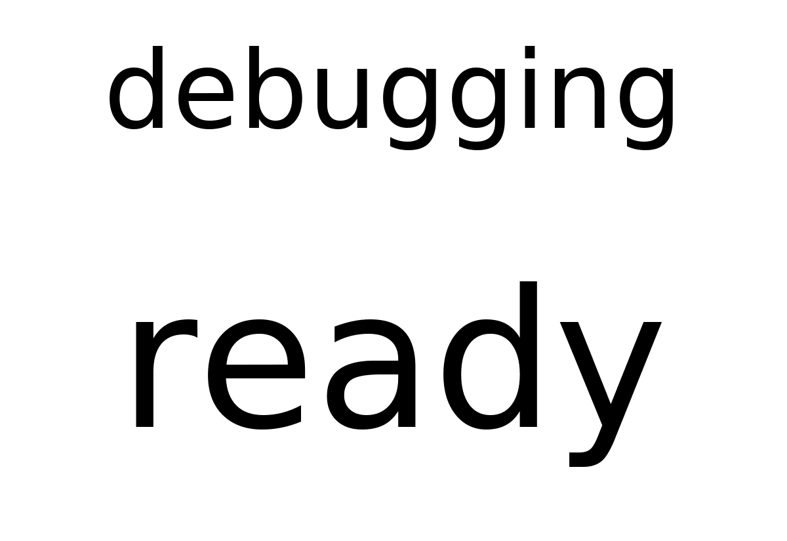

# debugging

A plugin for testing PaperPi itself. It can crash, hang, and switch between the states "nothing", "ready" and "alert" in a fixed pattern. It needs no network.

Every update adds 1 to a count kept in the file `count` in its storage folder (`/var/lib/paperpi/plugins/<name>/`). The count decides what the update does, so the same settings always give the same pattern.

## Layouts

| Layout | Shows |
|---|---|
| `text_state` (default) | `text` above the state ("ready", "alert") |

The image shows nothing else, no time or count, so two updates with the same state give the same image and the screen is not written again.

## Settings

| Setting | Default | Meaning |
|---|---|---|
| `text` | `"debugging"` | Text shown above the state, e.g. to tell several debugging plugins apart |
| `states` | `["ready"]` | States to report, one per update, then from the start |
| `crash_every` | `0` | Every Nth update raises an error; `0` = never |
| `hang_every` | `0` | Every Nth update hangs until its time limit stops it; `0` = never |
| `delay` | `0` | Seconds each update takes, like a slow web request |

It suggests a refresh every 30 seconds.

An alert every 3rd update, and a crash every 5th:

```toml
[[plugin]]
name = "Test alert"
type = "debugging"
level = "alert"
text = "test alert"
states = ["nothing", "nothing", "alert"]
crash_every = 5
refresh = 20
```

Try it without a screen: `uv run paperpi render debugging`.

## Sample images

All sample images are in [`tests/images/`](../../../../tests/images/), named `debugging-text_state-<screen>.png` (see [basic_clock](../basic_clock/README.md) for the screen names).


