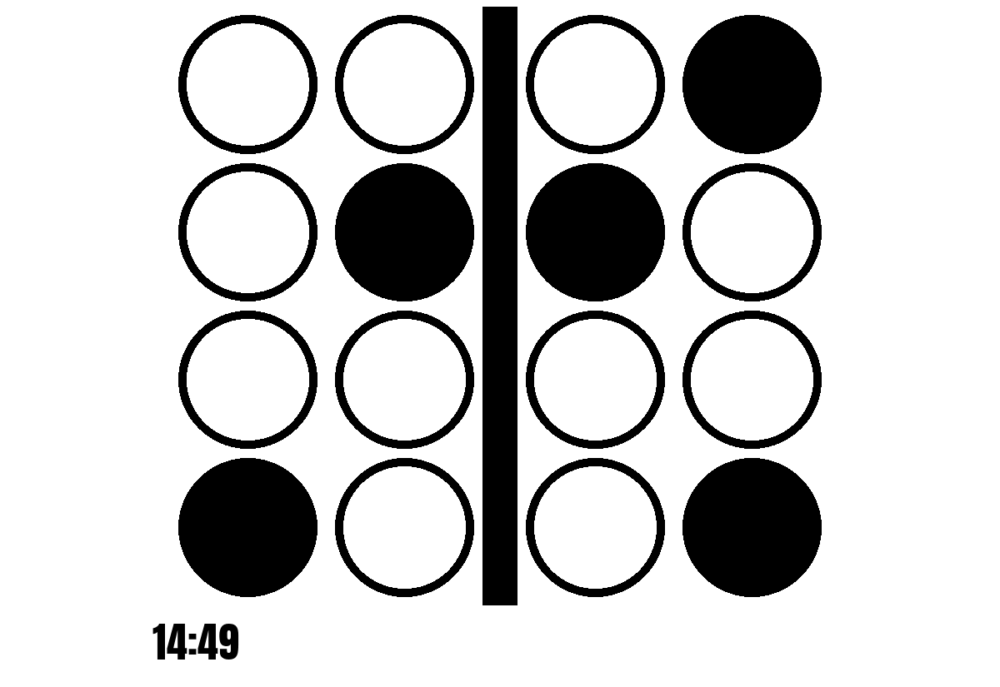
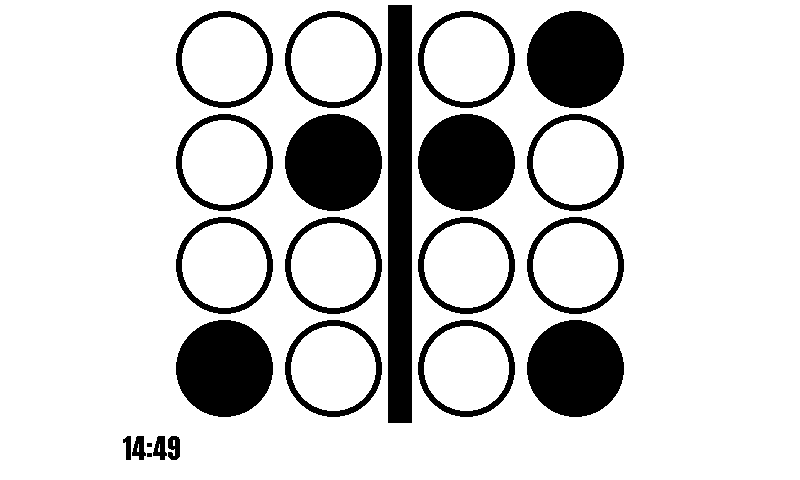
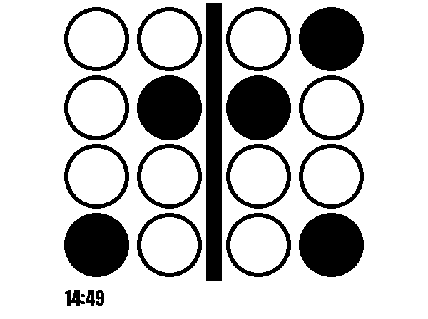

# dec_binary_clock

Shows the time as binary dots, with the time in digits small underneath. It needs no network. Ported from v1.

"Binary" means each dot is either filled or empty, and the filled dots of a column add up to one digit of the time.

## How to read it

There is one column of 4 dots for each digit of the 24-hour time: tens of the hour, ones of the hour, a bar (the colon), tens of the minute, ones of the minute. From top to bottom the dots of a column are worth 8, 4, 2 and 1. A filled dot counts, a ring doesn't; add up the filled dots to get the digit.

For 14:49:

```
 .  .  |  .  #     8
 .  #  |  #  .     4
 .  .  |  .  .     2
 #  .  |  .  #     1
 1  4     4  9
```

(`#` filled, `.` ring.) Every column has 4 dots, also those that never need all of them: the tens of the hour (0-2) never use the 8 and 4 dots, the tens of the minute (0-5) never use the 8 dot (the 4 dot is filled from :40 to :59).

## Layouts

| Layout | Shows |
|---|---|
| `dots_time` (default) | the dots, as large as fits, with the time in digits underneath ("14:49"). The digits move left and right at every update, as in v1 |

## Settings

None of its own, only the settings every plugin has (see the main [README](../../../../README.md)).

It suggests a refresh every 60 seconds, starting just after the minute changes.

In the config file:

```toml
[[plugin]]
name = "Binary Clock"
type = "dec_binary_clock"
```

Try it without a screen: `uv run paperpi render dec_binary_clock --size 800x480 --mode bw`.

The font is [Anton](https://fonts.google.com/specimen/Anton) by The Anton Project Authors, under the SIL Open Font License ([`fonts/Anton-OFL.txt`](../../fonts/Anton-OFL.txt)), in PaperPi's shared fonts folder, as in v1.

## Sample images

Sample time: 14:49 on Monday 5 October 2026. All sample images are in [`tests/images/`](../../../../tests/images/), named `dec_binary_clock-dots_time-<screen>.png`, where `<screen>` is `9in7` (9.7", 1200x825, 16 grays), `7in5` (7.5", 800x480, black and white) or `5in65` (5.65", 600x448, 7 colours).

| 9.7" | 7.5" black and white | 5.65" 7 colours |
|---|---|---|
|  |  |  |
