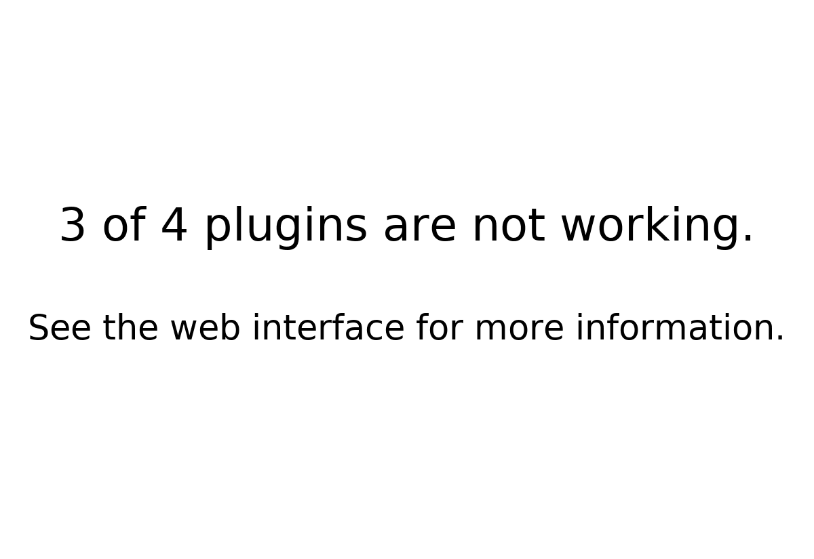

# default

Shown when nothing else can be shown because plugins are failing, or because no plugin is ready to show (switched on, with all its required settings filled in). The scheduler tells it how many plugins are not working, and it shows e.g. "3 of 4 plugins are not working. See the web interface for more information." It needs no network.

PaperPi always has this plugin, also when the config file has no block for it. A `[[plugin]]` block with `type = "default"` changes its settings; it never takes part in the rotation. The QR code that opens the web interface comes with the web interface (M5).

## Layouts

| Layout | Shows |
|---|---|
| `message` (default) | how many plugins are not working, and where to look |

## Settings

None of its own.

## Sample images

Sample: 3 of 4 plugins are not working. All sample images are in [`tests/images/`](../../../../tests/images/), named `default-message-<screen>.png` (see [basic_clock](../basic_clock/README.md) for the screen names).

