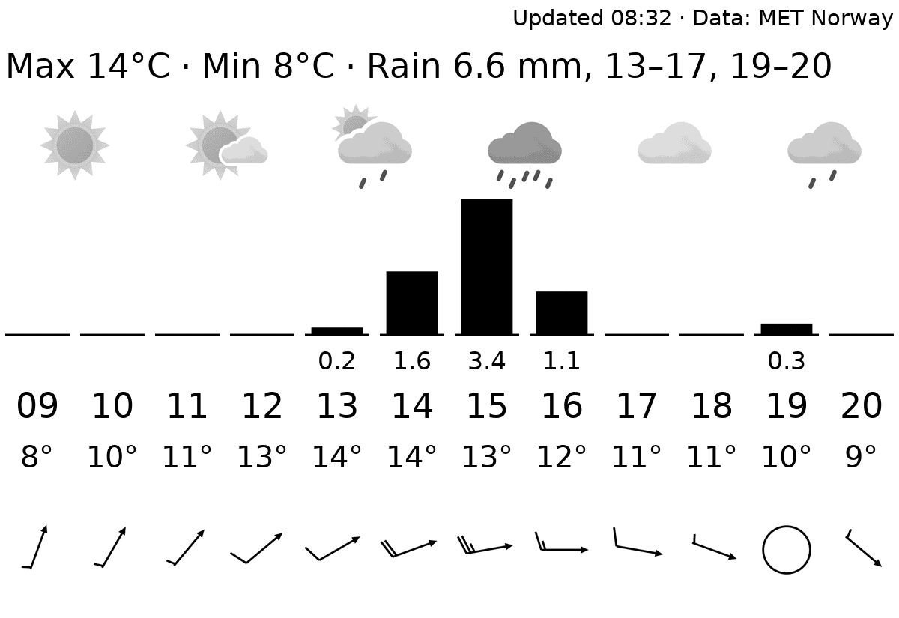
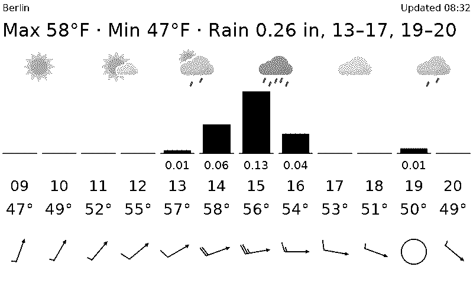

# met_no

The weather for the next 12 hours, from [met.no](https://api.met.no/) (the Norwegian Meteorological Institute). Free, with forecasts for places all over the world. It shows numbers, not advice:

- **a summary for the next 12 hours:** highest and lowest temperature, total rain, and the hours it rains ("Max 14°C · Min 8°C · Rain 6.6 mm, 13–17, 19–20"; 13–17 means from 13:00 to 17:00, and rain until midnight ends at "24");
- **per hour:** a bar for the rain (the mm under it), the temperature and a wind barb;
- **a met.no weather icon every 2 hours.**

The 12 hours start at the current hour. Times are shown in the Pi's own time zone.

## Wind barbs

A barb is a line with an arrowhead that points where the wind is **going**. The feathers at the other end give the speed in knots (1 knot is about 0.5 m/s or 1.9 km/h), rounded to steps of 5:

| Shape | Speed |
|---|---|
| circle | calm, under 1 knot |
| line and arrowhead only | 1 to 2.4 knots |
| short feather | 5 knots |
| long feather | 10 knots |
| triangle | 50 knots |
| warning triangle with "!" | over 105 knots |

Feathers add up: a long and a short feather is 15 knots; a triangle and two long feathers is 70.

## When met.no can't be reached

"Updated 08:32" at the top is when met.no last confirmed the forecast. After every download the plugin saves the trimmed forecast in its storage folder. If met.no can't be reached, it draws from the saved forecast (still starting at the current hour), and the "Updated" time shows how old it is. A saved forecast older than 6 hours is not used; the update then fails as usual. After a change of `lat` or `lon` the saved forecast is not used: it is for the old place.

The plugin follows met.no's [terms of service](https://api.met.no/doc/TermsOfService): it sends your email address (only to met.no) as contact, rounds the coordinates to 4 decimals, asks "has anything changed since my last download?", and doesn't download again before the time met.no's answer gives (at most 1 hour). In practice that is one download about every hour.

## Layouts

| Layout | Shows |
|---|---|
| `hours_12` (default) | place and "Updated" time, the summary line, an icon every 2 hours, then per hour the rain bar and mm, the hour, the temperature and the wind barb |

## Settings

| Setting | Default | Meaning |
|---|---|---|
| `lat` | none, required | latitude of the place, e.g. `52.52` |
| `lon` | none, required | longitude of the place, e.g. `13.40` |
| `email` | none, required | your email address, sent only to met.no. met.no requires contact details from every program, so it can ask before blocking one that misbehaves |
| `place` | `""` | name shown at the top, e.g. `"Berlin"`. Without it, the coordinates are shown ("52.52, 13.40") |
| `temperature` | `"C"` | `"C"` (Celsius) or `"F"` (Fahrenheit) |
| `rain` | `"mm"` | `"mm"` or `"inch"` |

Wind is always in knots, because the barbs are drawn in knots.

It suggests a refresh every 30 minutes. met.no updates its forecasts about once an hour.

In the config file (the rest of the file is shown in the main [README](../../../../README.md)):

```toml
[[plugin]]
name = "Weather Berlin"
type = "met_no"
lat = 52.52
lon = 13.40
place = "Berlin"
email = "you@example.com"
```

Try it without a screen: `uv run paperpi render met_no --set place=Berlin` (sample data), or with real data: `uv run paperpi render met_no --live --set lat=52.52 --set lon=13.40 --set email=you@example.com`.

The weather data is from [MET Norway](https://www.met.no/en) (the Norwegian Meteorological Institute), under the [Creative Commons 4.0 BY International](https://creativecommons.org/licenses/by/4.0/) licence. The weather icons are met.no's own, from [github.com/metno/weathericons](https://github.com/metno/weathericons), under the MIT licence ([`icons/LICENSE`](icons/LICENSE)).

## Sample images

The sample data is made up: a day in Berlin from 09:00, with a shower in the afternoon. All sample images are in [`tests/images/`](../../../../tests/images/), named `met_no-<layout>[-berlin-f]-<screen>.png`, where `<screen>` is `9in7` (9.7", 1200x825, 16 grays), `7in5` (7.5", 800x480, black and white) or `5in65` (5.65", 600x448, 7 colours). `berlin-f` shows the place name, °F and inches.

| `hours_12` | `hours_12`, °F and inches, 7.5" black and white |
|---|---|
|  |  |
