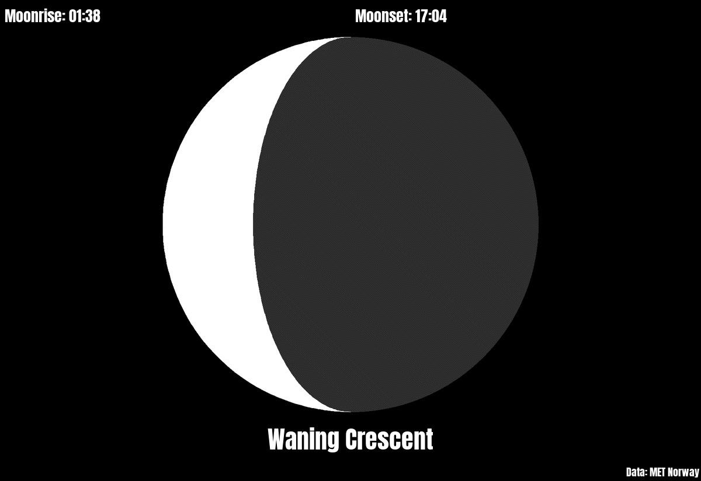
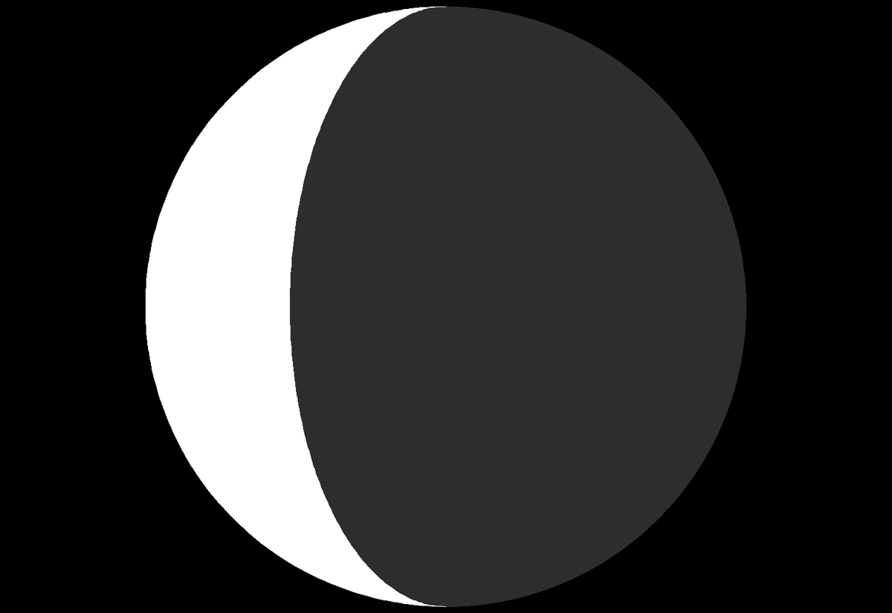
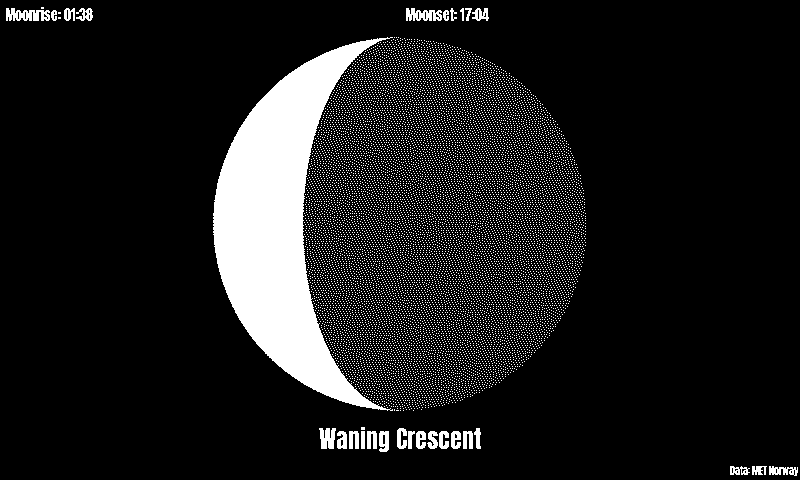

# moon_phase

Today's moon: a picture of its phase, the name of the phase ("Waning Crescent"), and the times it rises and sets at your place. White on black, like the night sky.

The data comes from [met.no](https://api.met.no/) (the Norwegian Meteorological Institute), from its free [sunrise service](https://docs.api.met.no/doc/sunrise/celestial.html), which works for places all over the world. Times are shown in the Pi's own time zone.

## The picture

The moon is drawn by the plugin: the sunlit part white, the dark part dark gray, so the whole disc shows even at new moon. It is the moon as seen from the northern half of the earth: lit from the right while it grows (waxing), from the left while it shrinks (waning).

The phase is met.no's phase angle, in degrees: 0 is new moon, 90 first quarter, 180 full moon, 270 last quarter. New moon, the quarters and full moon are moments; their name is shown for about a day around them (6° on each side). In between, the names are Waxing Crescent, Waxing Gibbous, Waning Gibbous and Waning Crescent.

On a day the moon doesn't rise or set (this happens about once a month, because the moon rises about 50 minutes later every day), the time shows "none".

## How often it asks met.no

met.no gives one answer per place and day. The plugin saves it in its storage folder and asks again only on the next day, or after a change of `lat` or `lon`. If met.no can't be reached, the update fails as usual and PaperPi tries again at the next update. It sends your email address (only to met.no) as contact and rounds the coordinates to 4 decimals, as met.no's [terms of service](https://api.met.no/doc/TermsOfService) ask.

## Layouts

| Layout | Shows |
|---|---|
| `moon_data` (default) | moonrise and moonset on top, the moon, the name of the phase, and "Data: MET Norway" small at the bottom |
| `moon_only` | the moon only, as large as fits |

## Settings

| Setting | Default | Meaning |
|---|---|---|
| `lat` | none, required | latitude of the place, e.g. `52.52` |
| `lon` | none, required | longitude of the place, e.g. `13.40` |
| `email` | none, required | your email address, sent only to met.no. met.no requires contact details from every program, so it can ask before blocking one that misbehaves |

It suggests a refresh every 20 minutes.

In the config file (the rest of the file is shown in the main [README](../../../../README.md)):

```toml
[[plugin]]
name = "Moon"
type = "moon_phase"
lat = 52.52
lon = 13.40
email = "you@example.com"
layout = "moon_only"   # optional; without it: moon_data
```

Try it without a screen: `uv run paperpi render moon_phase` (sample data), or with real data: `uv run paperpi render moon_phase --live --set lat=52.52 --set lon=13.40 --set email=you@example.com`.

The moon data is from [MET Norway](https://www.met.no/en), under the [Creative Commons 4.0 BY International](https://creativecommons.org/licenses/by/4.0/) licence; the `moon_data` layout shows "Data: MET Norway", as the licence asks. The font is Anton, under the SIL Open Font License ([`fonts/OFL.txt`](fonts/OFL.txt)).

## Sample images

The sample data is met.no's real answer for Berlin on 6 October 2026: a waning crescent, rising at 01:38 and setting at 17:04. All sample images are in [`tests/images/`](../../../../tests/images/), named `moon_phase-<layout>-<screen>.png`, where `<screen>` is `9in7` (9.7", 1200x825, 16 grays), `7in5` (7.5", 800x480, black and white) or `5in65` (5.65", 600x448, 7 colours).

| `moon_data` | `moon_only` | `moon_data`, 7.5" black and white |
|---|---|---|
|  |  |  |
