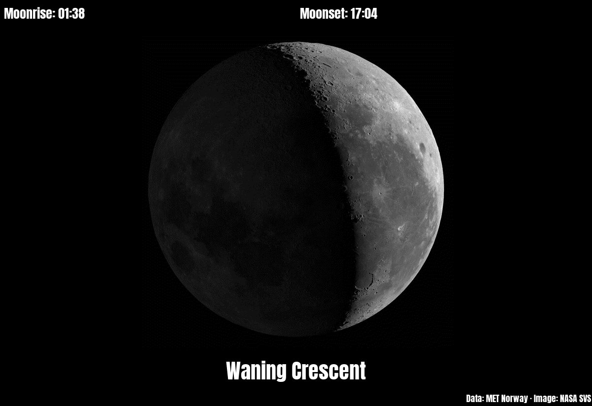

# moon_phase

Today's moon: a picture of its phase, the name of the phase ("Waning Crescent"), and the times it rises and sets at your place. White on black, like the night sky.

The data comes from [met.no](https://api.met.no/) (the Norwegian Meteorological Institute), from its free [sunrise service](https://docs.api.met.no/doc/sunrise/celestial.html), which works for places all over the world. Times are shown in the Pi's own time zone.

## The picture

The picture is one of 201 pictures of the moon made by NASA's Scientific Visualization Studio ([SVS 4955](https://svs.gsfc.nasa.gov/4955), "Moon Phase and Libration, 2022"). They are not photographs: a computer made them from the measurements of NASA's Lunar Reconnaissance Orbiter, a spacecraft that has mapped the moon's surface since 2009. There is one for every 1.8° of the phase, from the first full lunar month of 2022 (2 January to 1 February). The plugin shows the picture whose phase is nearest to today's (exactly halfway between two, the later one). The pictures show the moon as seen from the northern half of the earth. South of the equator (`lat` below 0) the moon looks upside down, so the picture is turned by 180°.

The phase is met.no's phase angle, in degrees: 0 is new moon, 90 first quarter, 180 full moon, 270 last quarter. New moon, the quarters and full moon are moments; their name is shown for about a day around them (6° on each side). In between, the names are Waxing Crescent, Waxing Gibbous, Waning Gibbous and Waning Crescent. Waxing means the lit part grows from day to day (from new moon to full moon), waning that it shrinks again. Crescent means less than half of the moon is lit, gibbous more than half.

On a day the moon doesn't rise or set (this happens about once a month, because the moon rises about 50 minutes later every day), the time shows "none".

## How often it asks met.no

met.no gives one answer per place and day. The plugin saves it in its storage folder (PaperPi's own folder for this plugin's files, `/var/lib/paperpi/plugins/<name>/`, where `<name>` is made from the plugin's `name` in the config file: `name = "Moon"` gives `moon`) and asks again only on the next day, or after a change of `lat` or `lon`. If met.no can't be reached, the update fails as usual and PaperPi tries again at the next update. It sends your email address (only to met.no) as contact and rounds the coordinates to 4 decimals, as met.no's [terms of service](https://api.met.no/doc/TermsOfService) ask.

## Layouts

| Layout | Shows |
|---|---|
| `moon_data` (default) | moonrise and moonset on top, the moon, the name of the phase, and "Data: MET Norway · Image: NASA SVS" small at the bottom |
| `moon_only` | the moon only, as large as fits |

## Settings

| Setting | Default | Meaning |
|---|---|---|
| `lat` | none, required | latitude of the place, e.g. `52.52` |
| `lon` | none, required | longitude of the place, e.g. `13.40` |
| `email` | none, required | your own, real email address, sent only to met.no. met.no's terms of service require contact details from every program, so it can ask before blocking one that misbehaves |

It suggests a refresh every 20 minutes.

In the config file (the rest of the file is shown in the main [README](../../../../README.md)):

```toml
[[plugin]]
name = "Moon"
type = "moon_phase"
lat = 52.52
lon = 13.40
email = "you@example.com"   # put your own, real address here
layout = "moon_only"   # optional; without it: moon_data
```

Try it without a screen: `uv run paperpi render moon_phase` (sample data), or with real data: `uv run paperpi render moon_phase --live --set lat=52.52 --set lon=13.40 --set email=you@example.com` (put your own address in place of `you@example.com`). If lat, lon or email is missing, the plugin is not shown; the config check and `paperpi list` say which one.

The moon data is from [MET Norway](https://www.met.no/en), under the [Creative Commons Attribution 4.0 International](https://creativecommons.org/licenses/by/4.0/) licence (CC BY 4.0): anyone may use the data, as long as they say where it came from. The `moon_data` layout shows "Data: MET Norway", as the licence asks. The moon pictures are by [NASA's Scientific Visualization Studio](https://svs.gsfc.nasa.gov/4955) (credit: NASA's Scientific Visualization Studio). NASA's pictures are generally not protected by copyright in the United States and may be used freely, as long as NASA is credited and the use does not suggest that NASA endorses PaperPi ([NASA's media usage guidelines](https://www.nasa.gov/nasa-brand-center/images-and-media/)). They are the same files as in PaperPi v1. The font is Anton, under the SIL Open Font License ([`fonts/Anton-OFL.txt`](../../fonts/Anton-OFL.txt)), in PaperPi's shared fonts folder.

## Sample images

The sample data is met.no's real answer for Berlin on 6 October 2026: a waning crescent, rising at 01:38 and setting at 17:04. All sample images are in [`tests/images/`](../../../../tests/images/), named `moon_phase-<layout>[-rio]-<screen>.png`, where `<screen>` is `9in7` (9.7", 1200x825, 16 grays), `7in5` (7.5", 800x480, black and white) or `5in65` (5.65", 600x448, 7 colours). `rio` has `lat` set to Rio de Janeiro's, so the picture is turned (the times are still the sample's, from Berlin).

| `moon_data` | `moon_only` | `moon_data`, south of the equator | `moon_data`, 7.5" black and white |
|---|---|---|---|
|  |  |  |  |
