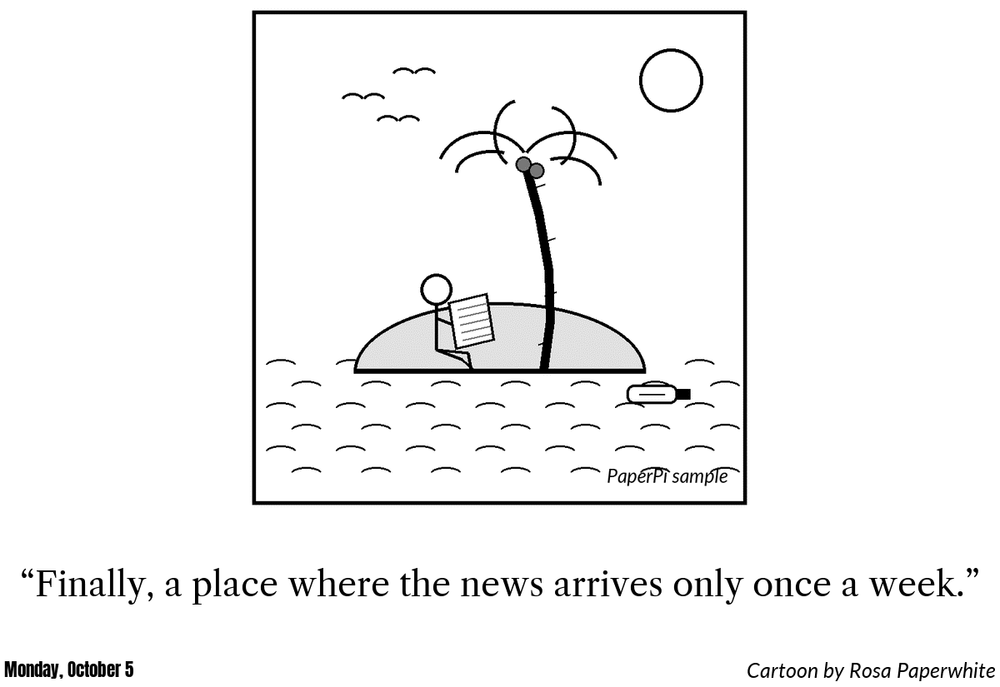
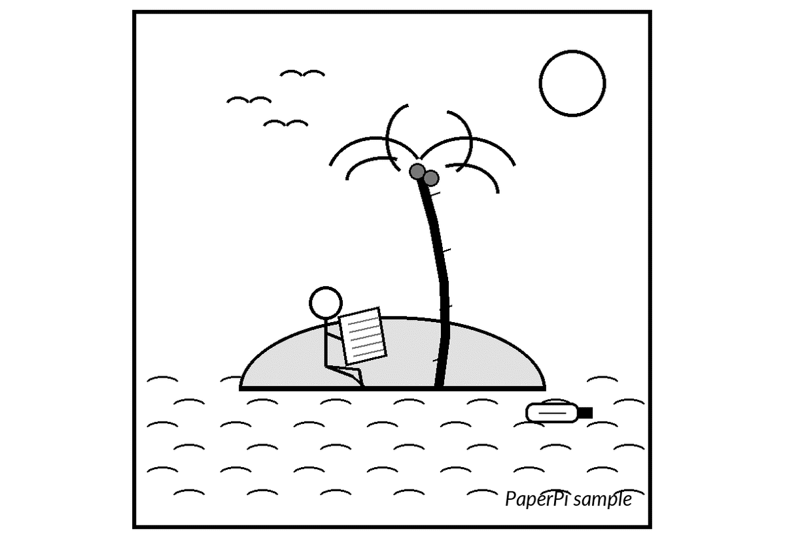

# newyorker

A random cartoon from [The New Yorker](https://www.newyorker.com)'s Daily Cartoon, with its caption, the cartoonist's name and the day it came out.

At each update the plugin downloads the Daily Cartoon feed (an RSS file: a small list of the newest cartoons, about 10, each with a title, date, cartoonist, picture and page), `https://www.newyorker.com/feed/cartoons/daily-cartoon`. It picks a random cartoon from the newest `day_range` ones, so with `day_range = 1` it always shows the newest. The feed has a cartoon for most weekdays, so `day_range = 5` is about the last week.

The feed doesn't have the captions, so for each new cartoon the plugin also downloads the cartoon's page on newyorker.com (about 800 kB) and reads the caption and "Cartoon by ..." from it. Some cartoons have their words inside the picture and no caption on the page. When there is no caption, or the page has changed, the cartoon's title and cartoonist from the feed are shown instead ("Monday, October 5th · Chris Gural"). When the page can't be downloaded, the title is shown and the page is tried again at the next update.

The picture (a JPEG file of about 400 kB) and the texts are saved in the plugin's storage folder, so each cartoon is downloaded only once. The saved files of cartoons that are no longer among the newest `day_range` are removed, so the folder holds at most `day_range` cartoons. When the disk is nearly full, new cartoons are shown without being saved.

When no new cartoon can be had (the feed or the picture can't be downloaded or read), a random saved cartoon is shown. If none is saved, the update fails, and PaperPi tries again at the next update.

Everything is downloaded only from newyorker.com and its servers (such as `media.newyorker.com`), over https, also after a redirect. Only JPEG and PNG pictures are used.

## Layouts

| Layout | Shows |
|---|---|
| `comic_caption_date` (default) | the cartoon, its caption on up to 3 lines, and a line with the date (left) and the cartoonist (right) |
| `comic_caption` | the cartoon, its caption and the cartoonist |
| `comic_only` | only the cartoon |

The caption is in Libre Caslon Text, as in v1, the date in Anton and the cartoonist in Lato Italic. Long captions are drawn smaller; text that still doesn't fit ends with "…". The fonts are [Libre Caslon Text](https://fonts.google.com/specimen/Libre+Caslon+Text) by The Libre Caslon Text Project Authors, [Anton](https://fonts.google.com/specimen/Anton) by The Anton Project Authors and [Lato](https://fonts.google.com/specimen/Lato) by Łukasz Dziedzic, all under the SIL Open Font License ([`fonts/LibreCaslonText-OFL.txt`](../../fonts/LibreCaslonText-OFL.txt), [`fonts/Anton-OFL.txt`](../../fonts/Anton-OFL.txt), [`fonts/Lato-OFL.txt`](../../fonts/Lato-OFL.txt)).

## Settings

| Setting | Default | Meaning |
|---|---|---|
| `day_range` | `5` | pick a random cartoon from this many of the newest ones (1 to 20; 1: always the newest) |

It suggests a refresh every hour.

In the config file (the rest of the file is shown in the main [README](../../../../README.md)):

```toml
[[plugin]]
name = "New Yorker"
type = "newyorker"
layout = "comic_caption"   # optional; without it: comic_caption_date
day_range = 1
```

Try it without a screen: `uv run paperpi render newyorker` (sample cartoon), or with a cartoon from the feed: `uv run paperpi render newyorker --live`.

## The cartoons

The cartoons and captions belong to The New Yorker and their cartoonists (© Condé Nast). PaperPi only downloads them to show on your own screen and does not share them. The sample cartoon, [`sample/island.png`](sample/island.png), its caption and its cartoonist ("Rosa Paperwhite") are made up: the drawing was made for PaperPi and is under PaperPi's licence.

## Sample images

All sample images are in [`tests/images/`](../../../../tests/images/), named `newyorker-<layout>-<screen>.png`, where `<screen>` is `9in7` (9.7", 1200x825, 16 grays), `7in5` (7.5", 800x480, black and white) or `5in65` (5.65", 600x448, 7 colours).

| `comic_caption_date`, 9.7" | `comic_caption`, 9.7" | `comic_only`, 9.7" |
|---|---|---|
|  |  |  |
