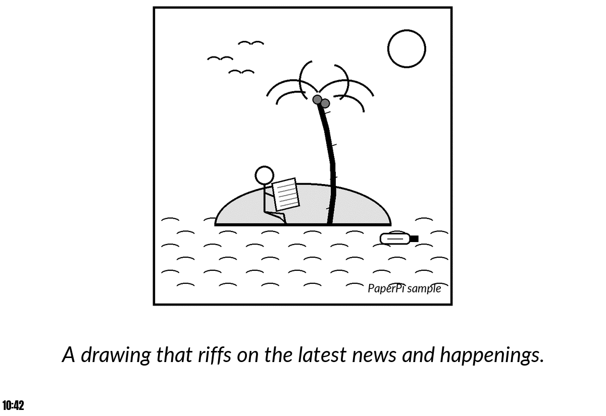
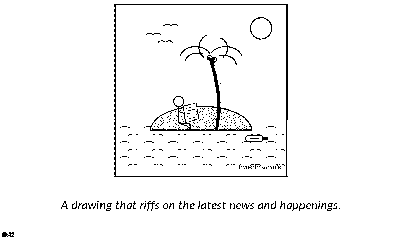
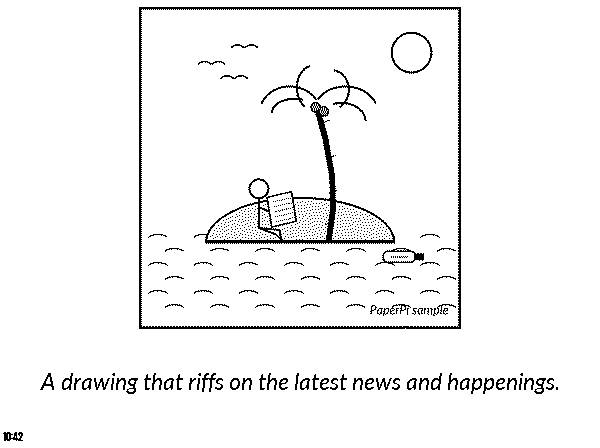

# newyorker

A random cartoon from [The New Yorker](https://www.newyorker.com)'s Daily Cartoon, with the text the feed gives for it, and the time it was fetched in the bottom left corner.

At each update the plugin downloads the Daily Cartoon feed (an RSS file: a small list of the newest cartoons, about 10, each with a picture address), `https://www.newyorker.com/feed/cartoons/daily-cartoon`. It picks a random cartoon from the newest `day_range` ones, so with `day_range = 1` it always shows the newest. Cartoons without a picture on https are left out. The feed has a cartoon for most weekdays, so `day_range = 5` is about the last week.

The cartoon's picture (a JPEG file of about 400 kB) is saved in the plugin's storage folder, so each cartoon is downloaded only once. Pictures of cartoons that are no longer among the newest `day_range` are removed, so the folder holds at most `day_range` pictures. When the disk is nearly full, new pictures are shown without being saved. Only JPEG and PNG pictures are used.

When the feed or the picture can't be downloaded or read, the update fails, and PaperPi tries again at the next update.

The feed now gives every cartoon the same text, "A drawing that riffs on the latest news and happenings.", not the cartoon's own caption. Most Daily Cartoons have their words inside the picture.

## Layouts

| Layout | Shows |
|---|---|
| `comic_caption_time` (default) | the cartoon, its text on up to 3 lines, and the time it was fetched |

The text is in Lato Italic and the time in Anton. Long texts are drawn smaller; text that still doesn't fit ends with "…". The fonts are [Lato](https://fonts.google.com/specimen/Lato) by Łukasz Dziedzic and [Anton](https://fonts.google.com/specimen/Anton) by The Anton Project Authors, both under the SIL Open Font License ([`fonts/Lato-OFL.txt`](../../fonts/Lato-OFL.txt), [`fonts/Anton-OFL.txt`](../../fonts/Anton-OFL.txt)).

## Settings

| Setting | Default | Meaning |
|---|---|---|
| `day_range` | `5` | pick a random cartoon from this many of the newest ones (1 to 50; 1: always the newest) |

It suggests a refresh every 2 minutes, as in v1.

In the config file (the rest of the file is shown in the main [README](../../../../README.md)):

```toml
[[plugin]]
name = "New Yorker"
type = "newyorker"
day_range = 1
```

Try it without a screen: `uv run paperpi render newyorker` (sample cartoon), or with a cartoon from the feed: `uv run paperpi render newyorker --live`.

## The cartoons

The cartoons belong to The New Yorker and their cartoonists (© Condé Nast). PaperPi only downloads them to show on your own screen and does not share them. The sample cartoon, [`sample/island.png`](sample/island.png), is not a New Yorker cartoon: it was drawn for PaperPi, and is under PaperPi's licence.

## Sample images

All sample images are in [`tests/images/`](../../../../tests/images/), named `newyorker-<layout>-<screen>.png`, where `<screen>` is `9in7` (9.7", 1200x825, 16 grays), `7in5` (7.5", 800x480, black and white) or `5in65` (5.65", 600x448, 7 colours).

| 9.7" | 7.5" | 5.65" |
|---|---|---|
|  |  |  |
