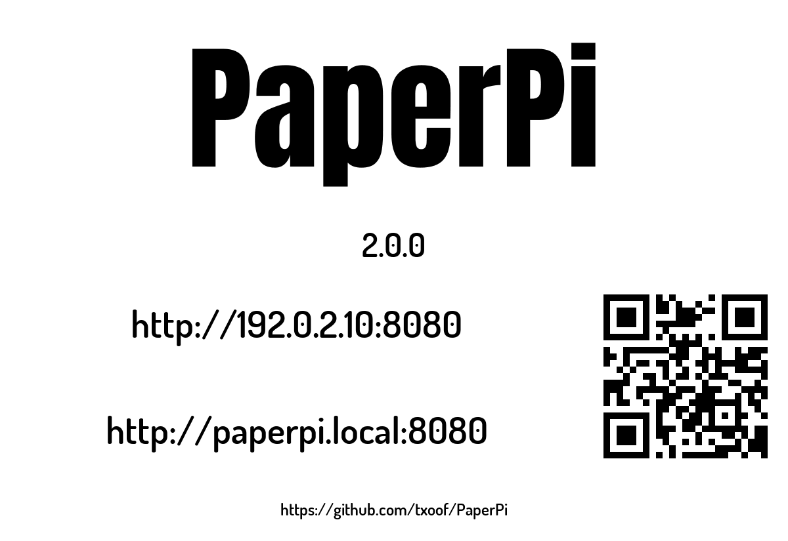
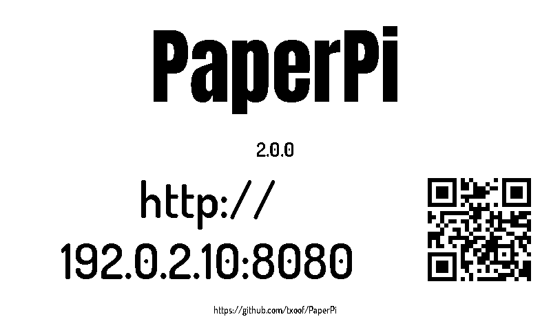
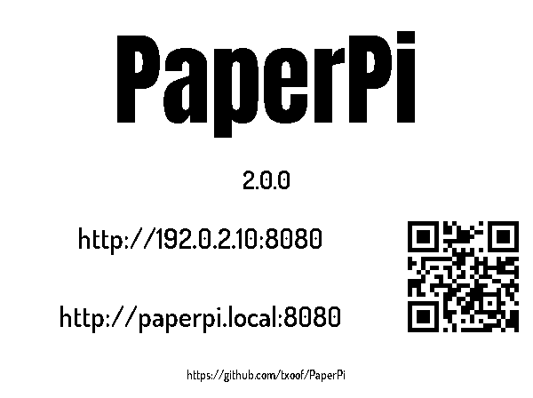

# splash_screen

Shows PaperPi's name, its version, the address of its web interface and a QR code with that address, plus the address of PaperPi's web page (https://github.com/txoof/PaperPi). Ported from v1.

PaperPi shows it **once at start**, before the other plugins, for `[display] splash_time` seconds (default 60; `0`: not at all). Meanwhile the other plugins get their first pictures. **With no plugin switched on**, for example the first start after installing with the default config, it stays on screen (with a new picture every hour) until a plugin is switched on, so the web address to set PaperPi up is always there. It is a plugin like any other, so start-up needs no drawing code of its own. You can also put it in the rotation with a `[[plugin]]` block, but that is not what it is meant for.

What it shows:

- the name, in large letters;
- the version of the PaperPi that is running, for example `2.0.0`;
- the web interface's address in two forms, one line each: by IP address (`http://192.0.2.10:8080`) and by host name (`http://paperpi.local:8080`). Some phones can't open `.local` names; the IP address always works, but can change when the router gives the Pi a new one;
- a QR code with the IP address, to open the web interface on a phone;
- PaperPi's GitHub address.

Without a network it says "No network" instead, with no QR code.

An address is never cut off: when it doesn't fit on one line, it is broken after a "/", then drawn smaller (v1 split the GitHub address over two lines for the same reason).

The web interface comes in milestone M5; until then the port is fixed at 8080, the port it will use. In Docker (M6), PaperPi may see the container's address instead of the Pi's; M6 deals with that.

## Layouts

| Layout | Shows |
|---|---|
| `splash` (default) | the name, the version, the two web addresses next to the QR code, and the GitHub address at the bottom |

## Settings

None of its own, only the settings every plugin has (see the main [README](../../../../README.md)). It suggests a refresh every hour, which only matters in the rotation (it then picks up a new IP address).

To put it in the rotation (not needed for the splash at start):

```toml
[[plugin]]
name = "Splash Screen"
type = "splash_screen"
```

Try it without a screen: `uv run paperpi render splash_screen --size 800x480 --mode bw` (with sample data; `--live` shows this Pi's real addresses).

The name is in [Anton](https://fonts.google.com/specimen/Anton) by The Anton Project Authors and the rest in [Dosis](https://fonts.google.com/specimen/Dosis) SemiBold by Edgar Tolentino, Pablo Impallari and Igino Marini, both as in v1. Both are under the SIL Open Font License ([`fonts/Anton-OFL.txt`](../../fonts/Anton-OFL.txt), [`fonts/Dosis-OFL.txt`](../../fonts/Dosis-OFL.txt)), in PaperPi's shared fonts folder. The QR code is made with [segno](https://github.com/heuer/segno).

## Sample images

The sample images show version 2.0.0, the made-up address 192.0.2.10 and the host name `paperpi`. All sample images are in [`tests/images/`](../../../../tests/images/), named `splash_screen-splash-<screen>.png`, where `<screen>` is `9in7` (9.7", 1200x825, 16 grays), `7in5` (7.5", 800x480, black and white) or `5in65` (5.65", 600x448, 7 colours).

| 9.7" | 7.5" black and white | 5.65" 7 colours |
|---|---|---|
|  |  |  |
