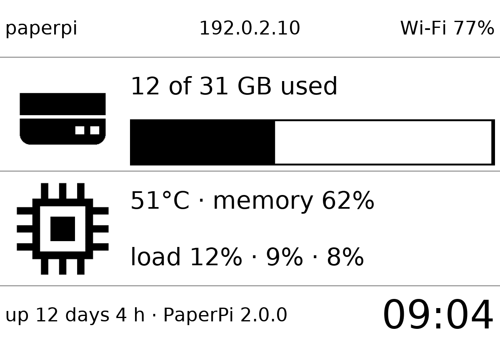
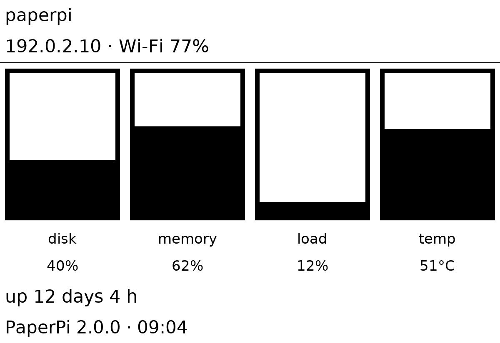
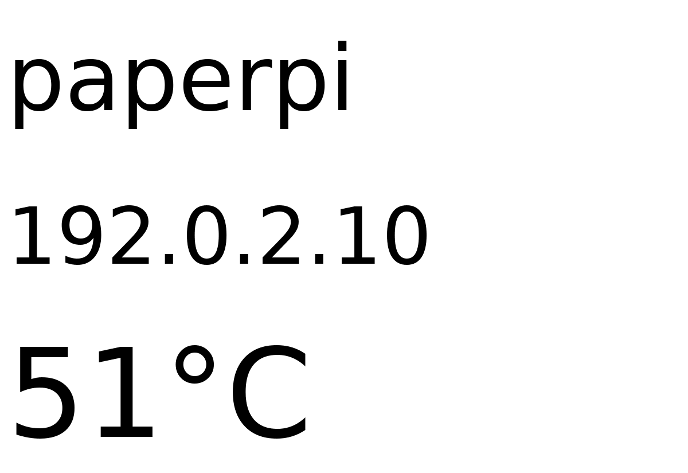

# system_info

Shows how this Pi is doing: its name and network address, the Wi-Fi signal, disk space, processor temperature and load, memory use, how long it has been running, and the PaperPi version. Useful to find the Pi on the network, and to see whether it is too hot or too full. It needs no network.

The numbers are read straight from the files Linux provides (`/proc` and `/sys`), so no extra package is needed. A number that can't be read is shown as "?".

| What | Meaning |
|---|---|
| Wi-Fi | link quality in % (the Pi's own Wi-Fi chip counts it from 0 to 70); only shown when the address shown is the Wi-Fi's, not the cable's |
| disk | "12 of 31 GB used" (TB from 1 TB on). Space the system keeps back for itself counts as used, so used and free add up to the total. GB here are 1,000,000,000 bytes, so the numbers differ a little from `df -h` |
| temperature | of the processor. The Pi slows itself down from about 85 °C |
| load | the average number of programs running or waiting (also for the SD card), over 1, 5 and 15 minutes, as % of all processor cores together. It can go above 100 % |
| memory | memory in use: everything except what programs could still get |

## Layouts

| Layout | Shows |
|---|---|
| `full` (default) | hostname, IP address and Wi-Fi on top; a disk row (icon, space used, bar) and a processor row (icon, temperature, memory, load); uptime, version and the time at the bottom |
| `portrait` | for tall screens: hostname, IP address and Wi-Fi; four upright bars for disk, memory, load (1 minute) and temperature (0–85 °C), with the number under each; uptime, version and the time |
| `small` | for tiny screens: hostname, IP address and temperature |

Which layout for which screen: `full` for wide screens of 5" and more, `portrait` for screens standing upright (text in `full` gets small there), `small` for 2" and 3" screens (on a 2.13" screen, `full` text is about 6 pixels high).

The screen shows the Pi's name and network address to anyone who can see it.

## Settings

| Setting | Default | Meaning |
|---|---|---|
| `text_color` | `"black"` | colour of the text, lines, icons and bars: `red`, `orange`, `yellow`, `green`, `blue`, `black`, `white`, or `random` |
| `background_color` | `"white"` | colour of the background, same choices |

On gray and black-and-white screens each colour becomes black or white, whichever is closer. `random` picks new colours once a day, always two that are easy to read together (pairs too close in brightness, such as white and yellow, are skipped).

It suggests a refresh every 120 seconds, starting just after the minute changes.

In the config file (the rest of the file is shown in the main [README](../../../../README.md)):

```toml
[[plugin]]
name = "System"
type = "system_info"
layout = "portrait"
```

Try it without a screen: `uv run paperpi render system_info --live --out /tmp/system_info.png`. (Real data: written outside the repository, so this Pi's name and address can't be committed by mistake.)

## Sample images

The sample data is made up: hostname `paperpi`, address `192.0.2.10` (a range set aside for examples). All sample images are in [`tests/images/`](../../../../tests/images/), named `system_info-<layout>[-inverse]-<screen>.png`, where `<screen>` is `9in7` (9.7", 1200x825, 16 grays), `7in5` (7.5", 800x480, black and white) or `5in65` (5.65", 600x448, 7 colours). `inverse` is white on black.

| `full` | `portrait` (on a wide screen) | `small` |
|---|---|---|
|  |  |  |
