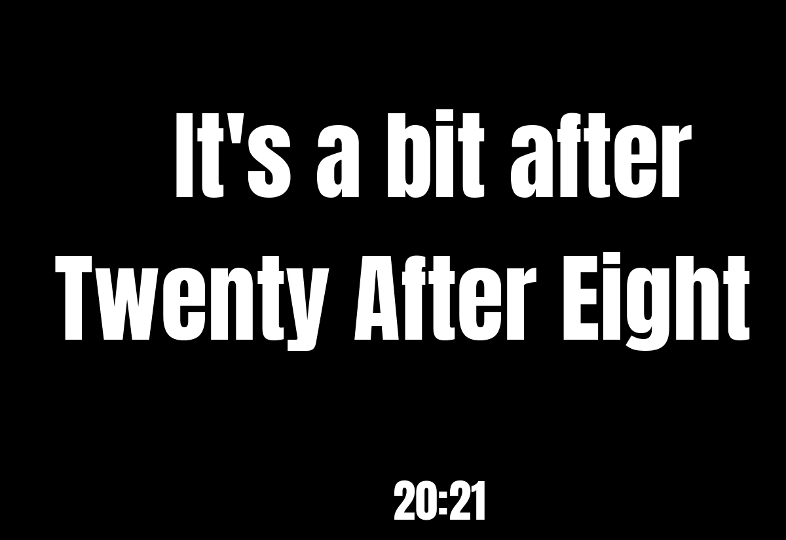
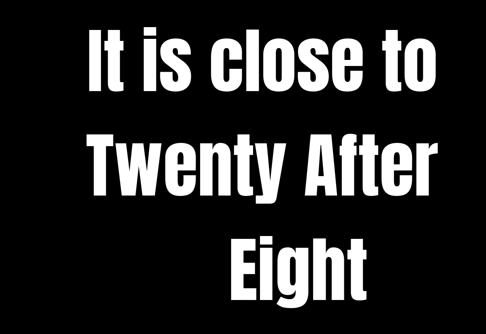
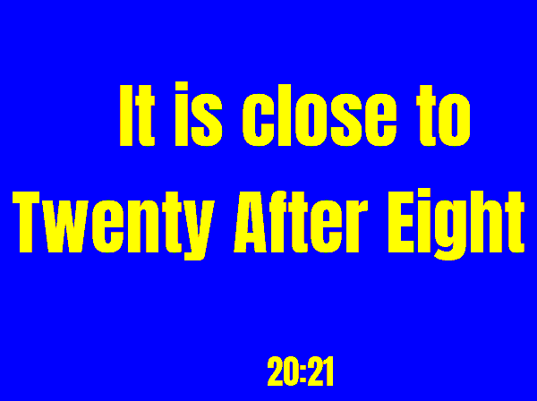

# word_clock

Shows the time in words, rounded to the nearest 10 minutes: "It's roughly Twenty After Eight", "It's nearly Ten 'Til Bedtime", "Give or take, it's Breakfast Sharp". It needs no network.

- **Rounding:** from :05 on the time rounds up (20:25 is "half past"), and from :35 on the sentence counts to the next hour (20:35 is "twenty 'til nine").
- **The words vary.** The opening, the minute words and the hour (a number or a nickname such as "lunch", "crack of dawn" or "go to bed") are picked anew for each 10-minute step. Within a step the time words stay the same. Only the opening may change, where the truth does: openings like "nearly" are used only while the time is a little before the step, "a bit after" only a little after it, and on the minute of the step itself a plain one ("It is about").
- **The text moves.** At every update the text is placed somewhere else on the screen, as in v1.
- The text size is chosen for the widest sentence the clock can make ("The time is nearly Twenty Before Crack Of Dawn"), so every sentence fits and the size never changes.

The word lists are in [`words.py`](words.py).

## Layouts

| Layout | Shows |
|---|---|
| `words_time` (default) | the sentence, large, with the time small underneath ("20:21") |
| `words` | the sentence only |

## Settings

| Setting | Default | Meaning |
|---|---|---|
| `text_color` | `"white"` | colour of the text: `red`, `orange`, `yellow`, `green`, `blue`, `black`, `white`, or `random` |
| `background_color` | `"black"` | colour of the background, same choices |

The colours are used as they are on colour screens. On gray and black-and-white screens each colour becomes black or white, whichever is closer (yellow becomes white, blue black). `random` picks a new colour for each 10-minute step, always one that is easy to read with the other colour (pairs too close in brightness, such as white and yellow or red and orange, are skipped). If both colours would look the same, the clock uses white on black and writes a warning to the log.

It suggests a refresh every 120 seconds, starting just after the minute changes. Each update moves the text, so each update is a screen write.

In the config file (the rest of the file is shown in the main [README](../../../../README.md)):

```toml
[[plugin]]
name = "Word Clock"
type = "word_clock"
display_time = 255
text_color = "random"
background_color = "random"
```

Try it without a screen: `uv run paperpi render word_clock --layout words --set text_color=yellow`.

The font is [Anton](https://fonts.google.com/specimen/Anton) by The Anton Project Authors, under the SIL Open Font License ([`fonts/Anton-OFL.txt`](../../fonts/Anton-OFL.txt)), in PaperPi's shared fonts folder.

## Sample images

Sample time: 20:21 on Monday 5 October 2026. All sample images are in [`tests/images/`](../../../../tests/images/), named `word_clock-<layout>[-colors]-<screen>.png`, where `<screen>` is `9in7` (9.7", 1200x825, 16 grays), `7in5` (7.5", 800x480, black and white) or `5in65` (5.65", 600x448, 7 colours). `colors` uses yellow text on blue.

| `words_time` | `words` | `words_time`, yellow on blue, 5.65" |
|---|---|---|
|  |  |  |
