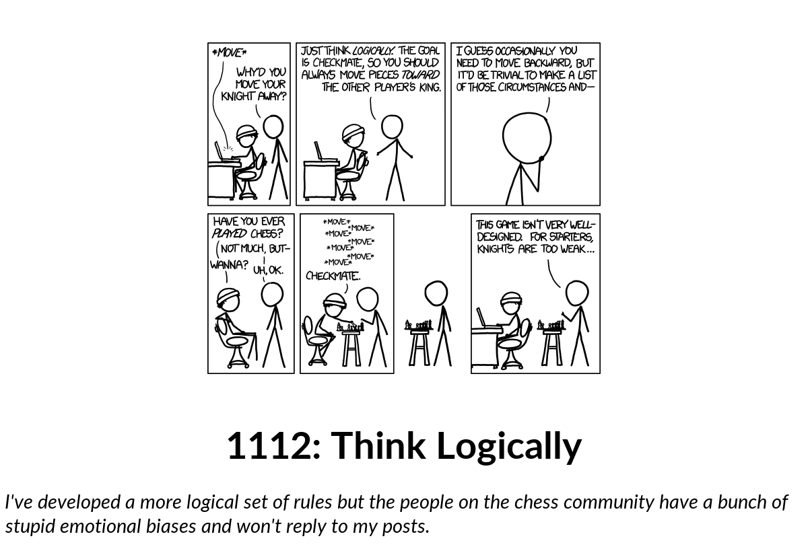
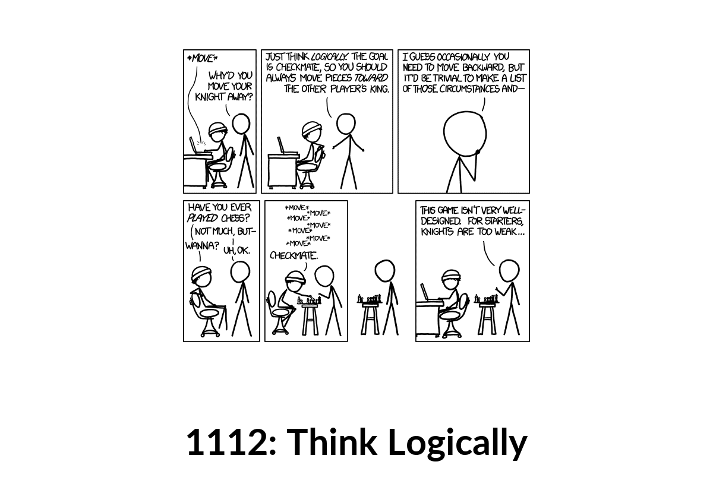
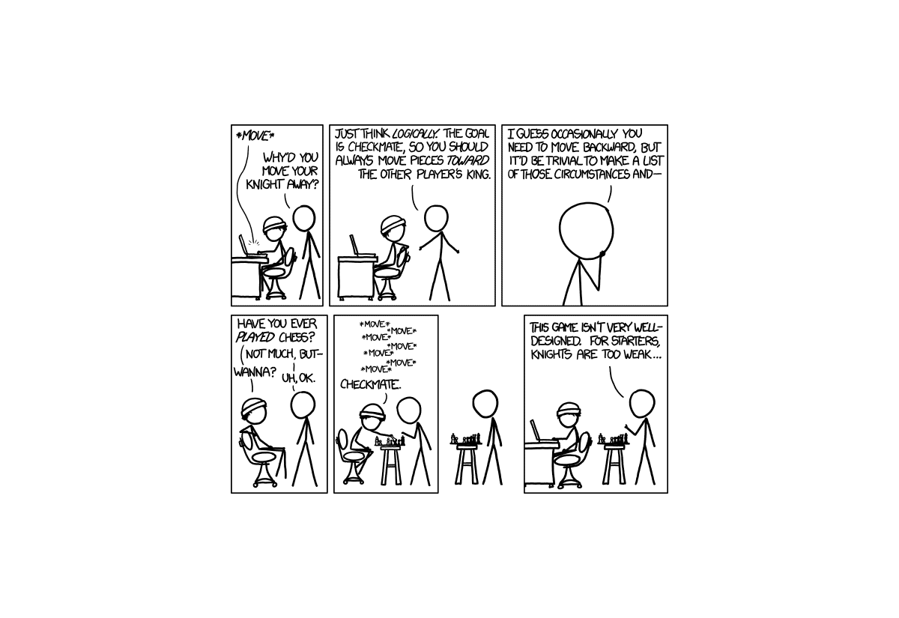
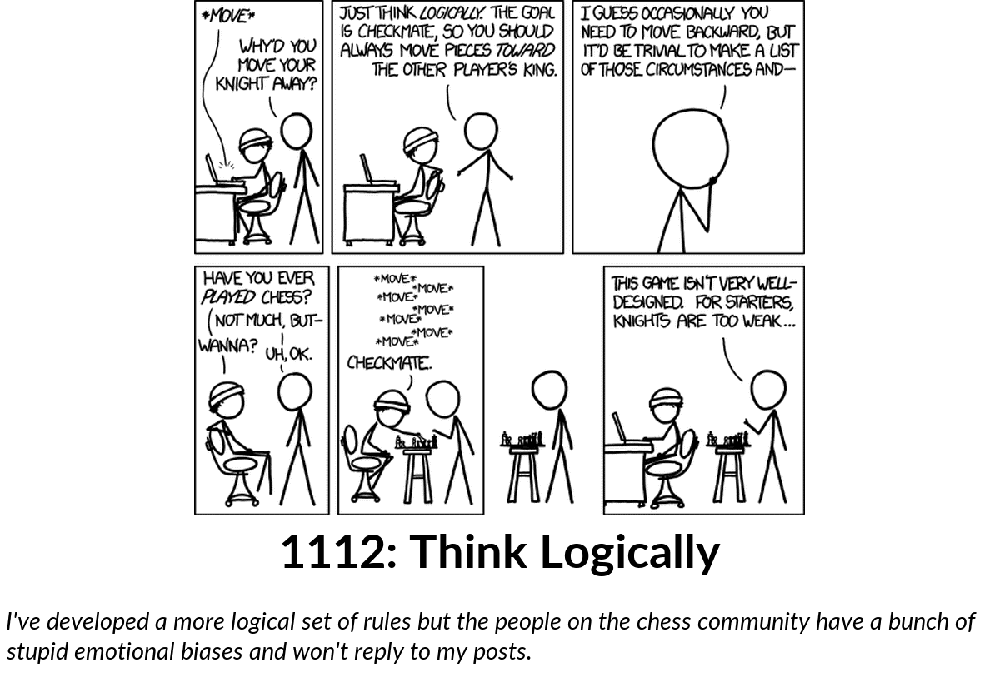

# xkcd_comic

A random comic (or the newest one) from [xkcd.com](https://xkcd.com) by Randall Munroe, with its number and title ("1112: Think Logically") and its hover text (the "alt text" that the website shows when the mouse is over the comic).

At each update it picks a random comic, from the first one to the newest. With `comic = "newest"` it shows the newest comic instead. Some comics are too large to read on an e-paper screen, and some are interactive pages without a picture. Those are skipped and another comic is picked, up to `tries` times. If none of them is suitable (or the newest comic is not), the update fails, and PaperPi tries again at the next update.

Comics smaller than the space on the screen keep their own size, so their lines stay sharp. With `enlarge = true` they are enlarged to fill the space. Comics larger than the space are always made smaller to fit.

The plugin uses xkcd's own [JSON interface](https://xkcd.com/json.html) (a small file per comic that lists its number, title, hover text and picture). Each update downloads three small files (two for the newest comic): the newest comic's number, the chosen comic's details, and its picture (more when comics are skipped). It saves nothing in its storage folder.

## Layouts

| Layout | Shows |
|---|---|
| `comic_title_alttext` (default) | the comic, its title on one line, and the hover text on up to 3 lines |
| `comic_title` | the comic and its title, on up to 2 lines |
| `comic_only` | only the comic |

The title is in Lato Bold and the hover text in Lato Italic. Long titles and hover texts are drawn smaller; text that still doesn't fit ends with "…". The font is [Lato](https://fonts.google.com/specimen/Lato) by Łukasz Dziedzic, under the SIL Open Font License ([`fonts/Lato-OFL.txt`](../../fonts/Lato-OFL.txt)).

## Settings

| Setting | Default | Meaning |
|---|---|---|
| `comic` | `"random"` | `"random"`: a random comic; `"newest"`: the newest comic |
| `max_width` | `800` | comics wider than this many pixels are skipped |
| `max_height` | `600` | comics taller than this many pixels are skipped |
| `tries` | `10` | how many random comics to try (1 to 20) before the update fails, when they are too large |
| `enlarge` | `false` | `true` enlarges comics that are smaller than the space on the screen |

It suggests a refresh every 20 minutes.

In the config file (the rest of the file is shown in the main [README](../../../../README.md)):

```toml
[[plugin]]
name = "xkcd"
type = "xkcd_comic"
layout = "comic_title"   # optional; without it: comic_title_alttext
comic = "newest"
max_width = 1000
```

Try it without a screen: `uv run paperpi render xkcd_comic` (sample comic), or with a random comic from xkcd.com: `uv run paperpi render xkcd_comic --live`.

## Licence of the comics

The comics are Randall Munroe's work, under the [Creative Commons Attribution-NonCommercial 2.5](https://creativecommons.org/licenses/by-nc/2.5/) licence (see [xkcd.com/license.html](https://xkcd.com/license.html)): they may be shared with credit, but not sold. The sample comic, [`sample/think_logically.png`](sample/think_logically.png) (xkcd 1112, "Think Logically"), and the sample images made from it are under that licence, not PaperPi's; see [`sample/LICENSE`](sample/LICENSE).

## Sample images

All sample images are in [`tests/images/`](../../../../tests/images/), named `xkcd_comic-<layout>[-enlarge]-<screen>.png`, where `<screen>` is `9in7` (9.7", 1200x825, 16 grays), `7in5` (7.5", 800x480, black and white) or `5in65` (5.65", 600x448, 7 colours). `enlarge` shows `enlarge = true`.

| `comic_title_alttext`, 9.7" | `comic_title`, 9.7" | `comic_only`, 9.7" | `comic_title_alttext`, enlarged, 9.7" |
|---|---|---|---|
|  |  |  |  |
